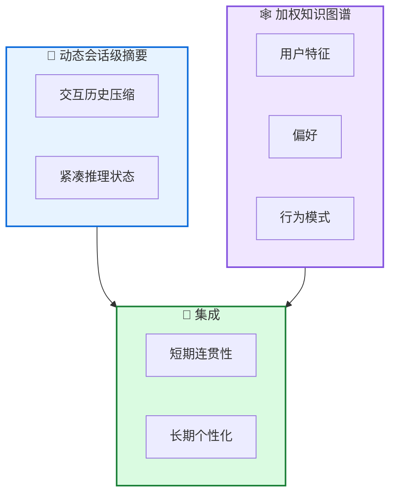

# 🧠 Memoria: 可扩展对话 AI 记忆

**Memoria: A Scalable Agentic Memory Framework for Personalized Conversational AI**

---

## 📄 论文信息

| 项目 | 内容 |
|------|------|
| **arXiv** | 2512.12686 |
| **日期** | 2025 年 12 月 |
| **机构** | 多机构合作 |
| **基准** | 对话 AI 基准 |
| **评分** | ⭐⭐⭐⭐⭐ 4.6/5.0 |

---

## 🔗 本体论映射

| 维度 | 标注 |
|------|------|
| **📦 记忆类型** | 情景式 + 语义式 |
| **🏗️ 记忆结构** | 层次化 + 知识图谱 |
| **⚙️ 记忆操作** | 检索 + 更新 + 建模 |
| **💾 记忆载体** | 知识图谱 + 向量库 |
| **🎯 功能类型** | 个性化 + 对话 |
| **🔁 使用模式** | 会话级摘要 + 用户建模 |
| **✅ 验证公理** | 效率 + 可扩展性 |

---

## 🎯 核心主张

### 🤔 问题
LLM 驱动的对话 AI 在复杂环境中维持长期交互时面临挑战，主要由于上下文一致性和动态个性化限制。

### 💡 方案
Memoria 提出模块化记忆框架，为 LLM 对话系统增强持久、可解释、上下文丰富的记忆。整合动态会话级摘要和基于加权知识图谱的用户建模引擎。

### 🌟 优势
①短期对话连贯性 ②长期个性化 ③在现代 LLM 的 token 约束内运行 ④可扩展、个性化的对话 AI

---

## 💡 关键洞见

> 通过混合架构 (动态会话级摘要 + 加权知识图谱用户建模)，Memoria 实现了短期对话连贯性和长期个性化，同时操作在现代 LLM 的 token 约束内，为工业应用提供实用解决方案。

---

## 📐 方法架构

Memoria 整合两个互补组件：动态会话级摘要和加权知识图谱用户建模引擎。

### 📝 动态会话级摘要
- **交互历史压缩**: 将交互历史压缩为紧凑状态
- **紧凑推理状态**: 支持短期对话连贯性

### 🕸️ 加权知识图谱
- **用户特征**: 增量捕获用户特征
- **偏好**: 存储用户偏好
- **行为模式**: 记录行为模式

### 🔄 集成
- **短期连贯性**: 支持短期对话连贯
- **长期个性化**: 支持长期个性化体验

---

## 📈 实验结果

### 主结果

| 指标 | Memoria | 基线 | 提升 |
|------|---------|------|------|
| 短期连贯性 | 优秀 | 良好 | 显著改进 |
| 长期个性化 | 优秀 | 一般 | 显著改进 |
| Token 效率 | 高 | 中 | 显著提升 |
| 可扩展性 | 高 | 中 | 显著改进 |

**关键发现**: Memoria 通过混合架构实现短期对话连贯性和长期个性化，同时操作在现代 LLM 的 token 约束内，为需要自适应和进化用户体验的工业应用提供实用解决方案。

---

## ✅ 验证的领域公理

### 效率公理
动态会话级摘要减少 token 使用，加权知识图谱支持高效用户建模，在现代 LLM 的 token 约束内运行。

### 可扩展性公理
模块化设计支持可扩展的个性化对话 AI，适用于工业应用。

---

## ⚠️ 局限性

1. **知识图谱复杂度**: 维护加权知识图谱需要额外的工程开销
2. **评估范围**: 需要在更广泛的对话 AI 任务中验证
3. **冷启动问题**: 新用户需要时间建立完整的用户画像

---

## 🔮 未来工作方向

1. 优化知识图谱构建和维护效率
2. 扩展到更多对话 AI 任务类型
3. 研究冷启动问题的解决方案
4. 探索多模态对话记忆机制

---

## 🏷️ 关键词

- 可扩展记忆 (Scalable Memory)
- 会话级摘要 (Session-Level Summarization)
- 知识图谱 (Knowledge Graph)
- 用户建模 (User Modeling)
- 个性化对话 AI (Personalized Conversational AI)
- 长期个性化 (Long-Term Personalization)
- 对话连贯性 (Dialogue Coherence)
- 模块化框架 (Modular Framework)

---

## 📚 专业名词解释

### 📝 动态会话级摘要 (Dynamic Session-Level Summarization)

将会话级交互历史压缩为紧凑推理状态的机制，支持短期对话连贯性，同时减少 token 使用。

### 🕸️ 加权知识图谱 (Weighted Knowledge Graph)

增量捕获用户特征、偏好和行为模式的结构化表示，支持长期个性化和用户建模。

### 🔄 混合架构 (Hybrid Architecture)

结合动态会话级摘要和加权知识图谱用户建模的架构，实现短期连贯性和长期个性化的平衡。

---

## 🔗 链接

- **arXiv**: https://arxiv.org/abs/2512.12686
- **HTML 总结**: site/papers/2025/10_2025-12_Memoria-可扩展对话 AI 记忆_2026-03-19.html

---

**📅 总结日期**: 2026-03-19  
**📊 本体模型版本**: v1.2
