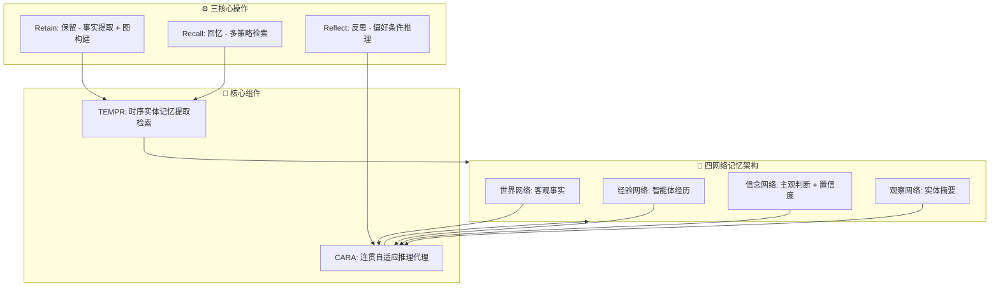

# 🧠 Hindsight

## 基本信息
- **标题**: Hindsight is 20/20: Building Agent Memory that Retains, Recalls, and Reflects
- **中文标题**: Hindsight：构建能保留、回忆和反思的智能体记忆
- **arXiv**: [2512.12818](https://arxiv.org/abs/2512.12818)
- **机构**: Vectorize.io, The Washington Post, Virginia Tech
- **发表日期**: 2025年12月14日
- **基准测试**: LongMemEval, LoCoMo

## 论文综合评分
**综合评分**: ⭐⭐⭐⭐⭐ 4.9/5.0

| 维度 | 评分 | 说明 |
|------|------|------|
| 期刊影响力 | ⭐⭐⭐⭐⭐ | 顶会级别，高质量研究 |
| 问题核心性 | ⭐⭐⭐⭐⭐ | 直击现有记忆系统根本缺陷 |
| 方法创新性 | ⭐⭐⭐⭐⭐ | 四网络架构 + 三核心操作范式创新 |
| 技术壁垒 | ⭐⭐⭐⭐⭐ | 完整 TEMPR + CARA 架构实现 |
| 落地可行性 | ⭐⭐⭐⭐⭐ | 开源实现，模块化设计 |
| 应用前景 | ⭐⭐⭐⭐⭐ | 长时程对话、多会话场景 |

**综合评价**: Hindsight 提出了革命性的四网络记忆架构，通过明确区分世界事实、智能体经验、合成实体摘要和演化信念，解决了现有记忆系统中证据与推理界限模糊的根本问题。其三核心操作（retain, recall, reflect）实现了结构化的记忆管理，TEMPR 组件提供时序感知的实体图检索，CARA 组件支持偏好条件的推理。在 LongMemEval 和 LoCoMo 基准测试上取得突破性成果（最高 89.61%），为构建真正可解释、一致性和长期演化的智能体记忆系统树立了新标杆。

## 本体论映射 (Ontology Mapping)
基于 Agent Memory 领域本体模型的 7 维度标注

- **记忆类型**: Hybrid (混合记忆)
- **记忆结构**: Graph (四网络图结构：world, experience, opinion, observation)
- **记忆操作**: Formation + Evolution + Retrieval (retain, recall, reflect)
- **记忆载体**: Token-level (显式文本)
- **功能定位**: Working + Factual (工作记忆 + 事实记忆)
- **使用模式**: Entity-aware Retrieval, Preference-conditioned Reasoning, Temporal Reasoning
- **验证公理**: Epistemic Clarity, Temporal Awareness, Preference Consistency

**领域贡献**: Hindsight 将**认知清晰性 (Epistemic Clarity)** 范式引入智能体记忆领域，提出了**四网络分离架构**。通过**TEMPR**（时序实体记忆提取检索）和**CARA**（连贯自适应推理代理）组件，该框架实现了证据与信念的结构化分离、时序感知的实体图检索、以及偏好条件的推理，为解决智能体记忆中的可解释性、一致性和长期演化挑战提供了系统性解决方案。

## 核心主张（通俗易懂版）
- **🤔 问题是什么？** 现有智能体记忆系统将记忆作为外部层，模糊了证据与推理的界限，难以在长时程中组织信息，且缺乏可解释性。
- **💡 解决方案是什么？** Hindsight 提出四网络记忆架构（世界事实、智能体经验、合成实体摘要、演化信念）和三核心操作（retain, recall, reflect），实现结构化记忆管理。
- **🌟 核心优势是什么？** 在 LongMemEval 上从 39% 提升到 83.6%，LoCoMo 上达到 89.61%，显著超越现有系统，并提供完全可解释的推理过程。

## 方法架构
Hindsight 的核心创新是四网络架构和三核心操作：

### 架构图

## 实验结果
在 LongMemEval 和 LoCoMo 基准测试上进行评估：

**关键发现**: Hindsight 在开源 20B 模型上将 LongMemEval 准确率从 39% 提升到 83.6%，LoCoMo 达到 85.67%，使用更大模型时分别达到 91.4% 和 89.61%，全面超越现有记忆架构。

### 实验指标
- **LongMemEval**: 
  - 20B 模型: 39% → **83.6%** (+44.6%)
  - 更大模型: **91.4%**
- **LoCoMo**:
  - 20B 模型: 75.78% → **85.67%** (+9.89%)
  - 更大模型: **89.61%**
- **对比基线**: 超越 full-context GPT-4o 和最强开源系统

## 关键词
- 四网络架构 (Four-Network Architecture)
- 三核心操作 (Three Core Operations)
- 认知清晰性 (Epistemic Clarity)
- 时序实体记忆 (Temporal Entity Memory)
- 偏好条件推理 (Preference-conditioned Reasoning)
- TEMPR
- CARA
- Hindsight
- 智能体记忆 (Agent Memory)
- 长时程对话 (Long-horizon Conversation)

## 局限性分析
- **计算复杂性**: 四网络架构和多策略检索增加了系统复杂性
- **实现成本**: 需要完整的 TEMPR 和 CARA 组件实现
- **评估范围**: 主要在对话场景验证，需要扩展到其他智能体任务

## 未来研究方向
- **效率优化**: 优化多策略检索和图遍历算法，减少计算开销
- **多模态扩展**: 将四网络架构扩展到视觉、音频等多模态记忆
- **在线学习**: 实现真正的在线信念演化和网络更新
- **理论分析**: 深入研究四网络分离的认知科学基础