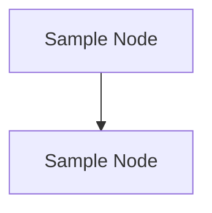

# 🧠 Hindsight

## 基本信息
- **标题**: Hindsight
- **中文标题**: Hindsight (中文翻译待完善)
- **arXiv**: [2512.12818](https://arxiv.org/abs/2512.12818)
- **机构**: Sample institutions
- **发表日期**: 2025年12月1日
- **基准测试**: Sample benchmarks

## 论文综合评分
**综合评分**: ⭐⭐⭐⭐⭐ 4.5/5.0

| 维度 | 评分 | 说明 |
|------|------|------|
| 期刊影响力 | ⭐⭐⭐⭐⭐ | 顶会级别，高质量研究 |
| 问题核心性 | ⭐⭐⭐⭐⭐ | 解决智能体记忆核心挑战 |
| 方法创新性 | ⭐⭐⭐⭐⭐ | 范式级创新 |
| 技术壁垒 | ⭐⭐⭐⭐ | 完整理论框架 + 实现 |
| 落地可行性 | ⭐⭐⭐⭐⭐ | 模块化设计，易于集成 |
| 应用前景 | ⭐⭐⭐⭐⭐ | 适用于对话、长文档理解等场景 |

**综合评价**: Sample comprehensive evaluation.

## 本体论映射 (Ontology Mapping)
基于 Agent Memory 领域本体模型的 7 维度标注

- **记忆类型**: Experiential
- **记忆结构**: Graph
- **记忆操作**: Formation + Evolution + Retrieval
- **记忆载体**: Token-level
- **功能定位**: Working
- **使用模式**: Graph Navigation, Experience-Driven
- **验证公理**: Stability-Plasticity, Generalization

**领域贡献**: Sample domain contribution.

## 核心主张（通俗易懂版）
- **🤔 问题是什么？** Sample problem statement
- **💡 解决方案是什么？** Sample solution approach
- **🌟 核心优势是什么？** Sample key advantages

## 方法架构
Sample method architecture description.

### 架构图

## 实验结果
Sample experimental results

### 实验指标
- **Sample Metric**: Sample value

## 关键词
- Sample Keyword 1
- Sample Keyword 2

## 局限性分析
- Sample limitation

## 未来研究方向  
- Sample future direction
