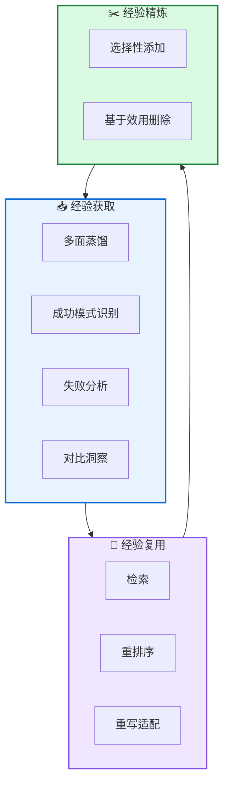

# 🔄 ReMe: 动态程序记忆框架

**Remember Me, Refine Me: A Dynamic Procedural Memory Framework for Experience-Driven Agent Evolution**

---

## 📄 论文信息

| 项目 | 内容 |
|------|------|
| **arXiv** | 2512.10696 |
| **日期** | 2025 年 12 月 |
| **机构** | 上海交大 + 阿里通义 |
| **基准** | BFCL-V3 / AppWorld |
| **评分** | ⭐⭐⭐⭐⭐ 4.8/5.0 |

---

## 🔗 本体论映射

| 维度 | 标注 |
|------|------|
| **📦 记忆类型** | 程序式 (Procedural) |
| **🏗️ 记忆结构** | 层次化 + 关键点级 |
| **⚙️ 记忆操作** | 蒸馏 + 复用 + 精炼 |
| **💾 记忆载体** | 向量数据库 |
| **🎯 功能类型** | 学习 + 推理 |
| **🔁 使用模式** | 经验驱动 + 自进化 |
| **✅ 验证公理** | 效率 + 记忆缩放效应 |

---

## 🎯 核心主张

### 🤔 问题
现有程序记忆系统受困于"被动积累"范式，将记忆视为静态追加存储，缺乏经验质量把控、上下文适配和及时更新机制。

### 💡 方案
ReMe 提出动态程序记忆框架，通过三方创新 (多面蒸馏/上下文自适应复用/基于效用的精炼) 实现从被动存储到反馈驱动进化的范式转变。

### 🌟 优势
①关键点级细粒度提取 ②记忆缩放效应 (8B+ReMe 超越 14B 无记忆) ③BFCL-V3/AppWorld SOTA ④效用追踪保持经验池活力

---

## 💡 关键洞见

> 记忆质量可以替代模型规模！ReMe 使 Qwen3-8B 超越 Qwen3-14B 无记忆基线 (Avg@4 +8.83%, Pass@4 +7.29%)，证明自进化记忆机制为资源高效终身学习开辟了新路径。

---

## 📐 方法架构

ReMe 包含三阶段交替循环：经验获取→经验复用→经验精炼。

### 📥 经验获取
- **多面蒸馏**: 成功模式识别、失败分析、对比洞察生成
- **关键点级**: 细粒度提取而非粗糙的轨迹级经验

### 🔄 经验复用
- **检索**: 基于使用场景索引
- **重排序**: 上下文感知重排序
- **重写适配**: 智能适配到新任务

### ✂️ 经验精炼
- **选择性添加**: 仅成功轨迹
- **基于效用删除**: 效用=成功次数/检索次数≤阈值时删除

---

## 📈 实验结果

### BFCL-V3 主结果 (Qwen3-8B)

| 方法 | Avg@4 | Pass@4 |
|------|-------|--------|
| No Memory | 40.33% | 59.55% |
| A-Mem | 41.22% | 62.00% |
| LangMem | 44.11% | 65.55% |
| **ReMe (dynamic)** | **45.17%** | **68.00%** |

### 记忆缩放效应

| 模型 | 方法 | Avg@4 | Pass@4 |
|------|------|-------|--------|
| Qwen3-8B | No Memory | 27.65 | 46.20 |
| **Qwen3-8B + ReMe** | **dynamic** | **34.94** | **55.03** |
| Qwen3-14B | No Memory | 35.62 | 54.65 |

**关键发现**: 记忆缩放效应！Qwen3-8B+ReMe (55.03% Pass@4) 超越 Qwen3-14B 无记忆 (54.65%)，证明有效记忆机制可缩小模型规模差距。

### 组件消融实验

| 选择性添加 | 失败反思 | 效用删除 | BFCL-V3 Avg@4 | BFCL-V3 Pass@4 |
|-----------|---------|---------|--------------|---------------|
| ❌ 全量添加 | ❌ | ❌ | 40.83% | 62.00% |
| ✅ | ❌ | ❌ | 44.33% | 64.66% |
| ✅ | ✅ | ❌ | 45.00% | 64.66% |
| ✅ | ✅ | ✅ | **45.17%** | **68.00%** |

选择性添加 (+3.50% Avg@4) > 失败反思 (+0.67%) > 效用删除 (+3.34% Pass@4)，证明经验质量优于数量。

---

## ✅ 验证的领域公理

### 效率公理
关键点级细粒度提取超越轨迹级粗糙提取 (+4.17% Avg@4)，基于效用删除保持经验池紧凑，检索开销降低。

### 记忆缩放效应
记忆质量可替代模型规模，8B+ReMe 超越 14B 无记忆，14B+ReMe 超越 32B 无记忆，为资源高效终身学习开辟新路径。

---

## ⚠️ 局限性

1. **固定检索策略**: 当前在任务开始时检索一次，缺乏上下文感知的动态检索机制
2. **LLM-as-Judge 局限**: 经验验证主要依赖 LLM 评判，可能忽略经验质量和相关性的细微方面
3. **摘要器规模效应**: 更大规模摘要器带来更大性能增益 (Qwen3-32B +3.33% Avg@4)

---

## 🔮 未来工作方向

1. 实现上下文感知的动态检索机制，支持任务执行中动态 incorporation 经验
2. 探索更复杂的经验验证技术，超越 LLM-as-Judge
3. 设计小模型高级摘要策略，降低对大规模摘要器的依赖
4. 扩展到更多任务类型和多模态场景

---

## 🏷️ 关键词

- 程序记忆 (Procedural Memory)
- 多面蒸馏 (Multi-faceted Distillation)
- 上下文自适应 (Context-Adaptive)
- 基于效用精炼 (Utility-Based Refinement)
- 记忆缩放效应 (Memory-Scaling Effect)
- 经验驱动进化 (Experience-Driven Evolution)
- 关键点级提取 (Keypoint-Level Extraction)
- 终身学习 (Lifelong Learning)

---

## 📚 专业名词解释

### 📚 多面蒸馏 (Multi-faceted Distillation)

三方分析：成功模式识别 (提取有效策略)、失败分析 (识别关键错误步骤)、对比洞察生成 (区分成功与失败的关键差异)，从轨迹中提取结构化可复用经验。

### 📚 上下文自适应复用 (Context-Adaptive Reuse)

三阶段管道：检索 (基于使用场景索引)→重排序 (上下文感知重排序)→重写 (智能适配到新任务)，确保 retrieved 经验与新任务需求对齐。

### 📚 基于效用的精炼 (Utility-Based Refinement)

双向更新：选择性添加 (仅成功轨迹) + 基于效用删除 (效用=成功次数/检索次数≤阈值时删除)，保持经验池紧凑高效。

---

## 🔗 链接

- **arXiv**: https://arxiv.org/abs/2512.10696
- **HTML 总结**: site/papers/2025/11_2025-12_ReMe-动态程序记忆框架_2026-03-19.html

---

**📅 总结日期**: 2026-03-19  
**📊 本体模型版本**: v1.2
