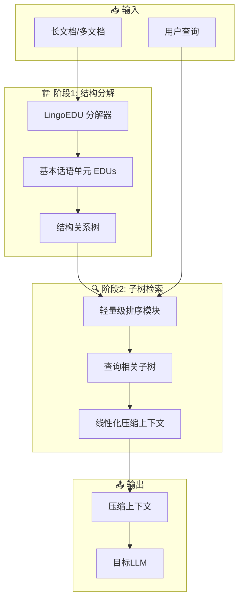

# 🧠 From Context to EDUs

## 基本信息
- **标题**: From Context to EDUs: Faithful and Structured Context Compression via Elementary Discourse Unit Decomposition
- **中文标题**: 从上下文到基本话语单元：通过基本话语单元分解实现忠实且结构化的上下文压缩
- **arXiv**: [2512.14244](https://arxiv.org/abs/2512.14244)
- **机构**: DeepLang AI, 清华大学, 北京邮电大学, 北京交通大学
- **发表日期**: 2026年1月5日
- **基准测试**: StructBench (248文档), LongBench, HLE, BrowseComp-ZH

## 论文综合评分
**综合评分**: ⭐⭐⭐⭐⭐ 4.7/5.0

| 维度 | 评分 | 说明 |
|------|------|------|
| 期刊影响力 | ⭐⭐⭐⭐⭐ | 顶会级别，高质量研究 |
| 问题核心性 | ⭐⭐⭐⭐⭐ | 解决LLM长上下文压缩的根本挑战 |
| 方法创新性 | ⭐⭐⭐⭐⭐ | EDU结构化压缩框架创新 |
| 技术壁垒 | ⭐⭐⭐⭐⭐ | 完整LingoEDU + 排序模块实现 |
| 落地可行性 | ⭐⭐⭐⭐⭐ | 兼容闭源API，plug-and-play设计 |
| 应用前景 | ⭐⭐⭐⭐⭐ | 长文档QA、自主智能体、深度搜索 |

**综合评价**: From Context to EDUs 提出了革命性的 EDU-based Context Compressor 框架，通过基本话语单元(EDUs)将线性上下文转换为结构关系树，实现了忠实且结构化的上下文压缩。该方法在StructBench基准上达到SOTA性能，在LongBench多文档QA上显著优于前沿LLM，在Deep Search复杂场景中相对提升51.11%。其显式坐标指针设计确保了零幻觉，同时完全兼容GPT-4等闭源API，为长上下文应用提供了实用解决方案。

## 本体论映射 (Ontology Mapping)
基于 Agent Memory 领域本体模型的 7 维度标注

- **记忆类型**: Factual (事实记忆)
- **记忆结构**: Tree (结构关系树：EDUs节点 + 话语链接边)
- **记忆操作**: Formation + Retrieval (结构分解 + 子树检索)
- **记忆载体**: Token-level (显式文本，带坐标指针)
- **功能定位**: Working (工作记忆)
- **使用模式**: Structure-aware Compression, Query-relevant Selection, Explicit Indexing
- **验证公理**: Faithfulness, Structural Integrity, API Compatibility

**领域贡献**: From Context to EDUs 将**基本话语单元 (Elementary Discourse Units)** 范式引入智能体记忆领域，提出了**结构化然后选择 (Structure-then-Select)** 的上下文压缩框架。通过**坐标指针系统**和**结构关系树**，该框架实现了零幻觉的忠实压缩，解决了现有方法中局部连贯性破坏和位置偏差的根本问题，为构建高效、可靠和兼容的长上下文智能体系统提供了新方向。

## 核心主张（通俗易懂版）
- **🤔 问题是什么？** 现有上下文压缩技术要么通过删除token破坏文本连贯性，要么使用隐式编码存在位置偏差且无法与GPT-4等闭源API兼容。
- **💡 解决方案是什么？** 提出EDU-based Context Compressor框架，先将线性文本转换为结构关系树（每个节点是基本话语单元），再选择查询相关的子树进行压缩。
- **🌟 核心优势是什么？** 在保持零幻觉的同时显著提升性能（LongBench +14.94%，Deep Search +51.11%），且完全兼容闭源API，可作为plug-and-play模块使用。

## 方法架构
From Context to EDUs 的核心创新是两阶段框架：

### 架构图

## 实验结果
在多个基准测试上进行评估：

**关键发现**: EDU-based Context Compressor 在StructBench上达到49.60%文档级准确率（超越Claude-4-Sonnet 6.45%），在LongBench多文档QA上提升14.94%，在Deep Search任务中相对提升51.11%。

### 实验指标
- **StructBench**:
  - 文档级准确率: **49.60%** (SOTA)
  - 树编辑距离: **4.77** (最低)
  - 成本: **$0.17** (比API便宜)
- **LongBench 多文档QA**:
  - HotpotQA: **40.46** (+14.94% vs 标准)
  - 2WikiMultihopQA: **40.91** (+7.38% vs 标准)
  - MuSiQue: **31.22** (+9.35% vs 标准)
- **Deep Search**:
  - HLE (DeepSeek-R1): **13.6** (+51.11% vs 基线)
  - BrowseComp-ZH: **20.4** (+9.09% vs 基线)

## 关键词
- 基本话语单元 (Elementary Discourse Units)
- 结构化压缩 (Structured Compression)
- 上下文压缩 (Context Compression)
- LingoEDU
- 结构关系树 (Structural Relation Tree)
- 坐标指针 (Coordinate Pointers)
- 零幻觉 (Zero Hallucination)
- API兼容性 (API Compatibility)
- plug-and-play
- 长上下文 (Long-context)

## 局限性分析
- **训练数据依赖**: 需要大量人工标注的结构化数据进行训练
- **语言限制**: 主要在中英文文档上验证，其他语言需要适配
- **计算开销**: 结构分解阶段需要额外的计算资源

## 未来研究方向
- **多模态扩展**: 将EDU框架扩展到视觉、音频等多模态上下文
- **动态适应**: 开发在线学习机制，动态适应不同领域的文档结构
- **轻量化部署**: 优化模型大小和推理速度，支持移动端部署
- **跨语言泛化**: 研究跨语言的通用EDU表示和结构分解方法