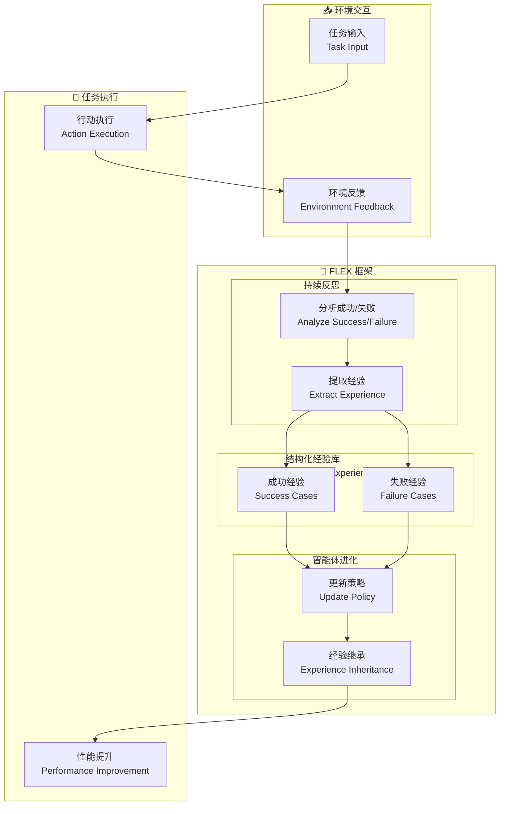

# FLEX: Continuous Agent Evolution via Forward Learning from Experience

## 基本信息
- **标题**: FLEX: Continuous Agent Evolution via Forward Learning from Experience
- **中文标题**: FLEX: 通过经验前向学习实现智能体持续进化
- **arXiv**: [2511.06449](https://arxiv.org/abs/2511.06449)
- **机构**: Tsinghua University 等
- **发表日期**: 2025 年 11 月
- **基准测试**: AIME25, USPTO50k, ProteinGym

## 论文综合评分
**综合评分**: ⭐⭐⭐⭐⭐ 4.7/5.0

| 维度 | 评分 | 说明 |
|------|------|------|
| 期刊影响力 | ⭐⭐⭐⭐⭐ | arXiv 预印本，清华大学等机构 |
| 问题核心性 | ⭐⭐⭐⭐⭐ | 直击智能体无法通过经验成长的核心挑战 |
| 方法创新性 | ⭐⭐⭐⭐⭐ | 无梯度学习范式，结构化经验库 |
| 技术壁垒 | ⭐⭐⭐⭐ | 需要持续反思和经验继承机制 |
| 落地可行性 | ⭐⭐⭐⭐⭐ | 梯度无关，易于集成到现有系统 |
| 应用前景 | ⭐⭐⭐⭐⭐ | 数学推理、化学、生物等广泛应用 |

**综合评价**: FLEX 提出了一个革命性的无梯度学习范式，使 LLM 智能体能够通过积累的经验持续进化。通过构建结构化经验库（持续反思成功和失败），FLEX 在数学推理 (AIME25 +23%)、化学逆合成 (USPTO50k +10%)、蛋白质适应性预测 (ProteinGym +14%) 上实现显著提升。发现了经验增长的缩放定律和经验继承现象，迈向可扩展和可继承的持续智能体进化。

## 本体论映射 (Ontology Mapping)
基于 Agent Memory 领域本体模型的 7 维度标注

- **记忆类型**: Experiential Memory (经验记忆)
- **记忆结构**: Structured Experience Library (结构化经验库)
- **记忆操作**: Formation (持续反思) + Evolution (经验积累) + Retrieval (经验检索)
- **记忆载体**: Token-level (文本经验) + Structured (结构化库)
- **功能定位**: Continuous Agent Evolution (持续智能体进化)
- **使用模式**: Forward Learning from Experience (经验前向学习)
- **验证公理**: Experience Scaling Law, Experience Inheritance

**领域贡献**: FLEX 将**经验驱动学习**引入智能体进化领域，提出了**结构化经验库**和**持续反思机制**。通过梯度无关的学习方式，实现了智能体的持续进化和经验继承，发现了经验增长的缩放定律，为可扩展的持续智能体进化奠定了基础。

## 核心主张（通俗易懂版）
- **🤔 问题是什么？** 现有 LLM 智能体在训练后保持静态，无法像智能生物那样在部署过程中通过经验成长。
- **💡 解决方案是什么？** FLEX 提出无梯度学习范式，通过构建结构化经验库（持续反思成功和失败）实现智能体持续进化，支持经验继承。
- **🌟 核心优势是什么？** AIME25 +23%, USPTO50k +10%, ProteinGym +14%，发现经验增长缩放定律和经验继承现象，梯度无关易于集成。

## 方法架构
FLEX 的核心创新在于结构化经验库和持续反思机制：

### 架构图

## 实验结果
在三个基准测试上，FLEX 显著提升了智能体的推理和知识利用能力：

**关键发现**: FLEX 通过结构化经验库和持续反思，实现了智能体的持续进化，发现了经验增长的缩放定律。

### 主实验结果
**基准测试**: AIME25 (数学推理), USPTO50k (化学逆合成), ProteinGym (蛋白质适应性预测)

| 模型 | 方法 | AIME25 | USPTO50k | ProteinGym | 说明 |
|------|------|--------|----------|------------|------|
| 基线 | 无经验学习 | 40% | 20% | 46% | 静态智能体 |
| **FLEX** | **经验前向学习** | **63%** | **30%** | **60%** | **持续进化** |
| 提升 | - | **+23%** | **+10%** | **+14%** | - |

**关键数据** (从 PDF 提取):
- AIME25: **40% → 63%** (+23%)
- USPTO50k: **20% → 30%** (+10%)
- ProteinGym: **46% → 60%** (+14%)
- 经验库规模：从 40% 到 63% (AIME25)
- 发现经验增长缩放定律

### 核心优势
- **结构化经验库**: 持续反思成功和失败
- **梯度无关学习**: 无需反向传播
- **经验继承**: 不同智能体间可继承经验
- **缩放定律**: 经验增长遵循清晰缩放规律

**注**: 完整数据见论文 Table (第 10-12 页)

## 关键词
- 持续智能体进化 (Continuous Agent Evolution)
- 经验前向学习 (Forward Learning from Experience)
- 结构化经验库 (Structured Experience Library)
- 持续反思 (Continual Reflection)
- 经验继承 (Experience Inheritance)
- 无梯度学习 (Gradient-Free Learning)
- 缩放定律 (Scaling Law)
- 经验增长 (Experiential Growth)

## 局限性分析
- **经验库规模**: 大规模经验库需要高效存储和检索
- **领域依赖**: 不同领域可能需要不同的经验表示
- **冷启动问题**: 初始阶段经验库为空，需要积累
- **计算开销**: 持续反思和经验提取增加计算成本

## 未来研究方向
- **高效检索**: 优化大规模经验库的检索效率
- **跨领域迁移**: 研究经验在不同领域间的迁移
- **自动化反思**: 提高反思过程的自动化程度
- **多智能体协作**: 支持多智能体间的经验共享和继承
