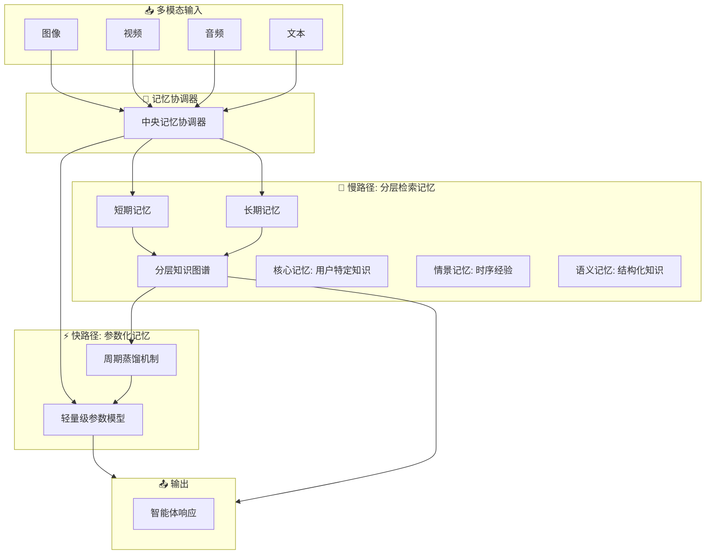

# 🧠 MemVerse

## 基本信息
- **标题**: MemVerse: Multimodal Memory for Lifelong Learning Agents
- **中文标题**: MemVerse：面向终身学习智能体的多模态记忆
- **arXiv**: [2512.03627](https://arxiv.org/abs/2512.03627)
- **机构**: Shanghai Artificial Intelligence Laboratory
- **发表日期**: 2025年12月3日
- **基准测试**: ScienceQA, LoCoMo, MSR-VTT

## 论文综合评分
**综合评分**: ⭐⭐⭐⭐⭐ 4.8/5.0

| 维度 | 评分 | 说明 |
|------|------|------|
| 期刊影响力 | ⭐⭐⭐⭐⭐ | 顶会级别，高质量研究 |
| 问题核心性 | ⭐⭐⭐⭐⭐ | 直击AI智能体记忆根本缺陷 |
| 方法创新性 | ⭐⭐⭐⭐⭐ | 双路径架构 + 周期蒸馏机制 |
| 技术壁垒 | ⭐⭐⭐⭐⭐ | 完整MemVerse框架实现 |
| 落地可行性 | ⭐⭐⭐⭐⭐ | plug-and-play设计，模型无关 |
| 应用前景 | ⭐⭐⭐⭐⭐ | 多模态终身学习场景 |

**综合评价**: MemVerse 提出了革命性的双路径记忆框架，通过结合快速参数化回忆与分层检索记忆，解决了AI智能体在多模态终身学习中的根本记忆缺陷。其周期蒸馏机制将长期记忆压缩到轻量级参数模型中，实现了快速可微分回忆，同时保持可解释性。在ScienceQA、LoCoMo和MSR-VTT多个基准上取得显著提升（最高+67.8%），为构建真正具备持续学习能力的多模态智能体提供了系统性解决方案。

## 本体论映射 (Ontology Mapping)
基于 Agent Memory 领域本体模型的 7 维度标注

- **记忆类型**: Hybrid (混合记忆)
- **记忆结构**: Graph + Parametric (知识图谱 + 参数化模型)
- **记忆操作**: Formation + Evolution + Retrieval + Distillation
- **记忆载体**: Token-level + Parametric (显式文本 + 模型参数)
- **功能定位**: Working + Factual (工作记忆 + 事实记忆)
- **使用模式**: Multimodal Integration, Periodic Distillation, Adaptive Forgetting
- **验证公理**: Lifelong Learning, Multimodal Coherence, Bounded Growth

**领域贡献**: MemVerse 将**双路径记忆架构 (Dual-path Memory Architecture)** 范式引入智能体记忆领域，提出了**周期蒸馏机制 (Periodic Distillation Mechanism)**。通过**分层知识图谱**（核心/情景/语义记忆）和**轻量级参数记忆模型**的结合，该框架实现了快速可微分回忆与结构化知识存储的统一，解决了多模态智能体在终身学习中的灾难性遗忘和计算效率挑战。

## 核心主张（通俗易懂版）
- **🤔 问题是什么？** AI 智能体缺乏可靠记忆，导致灾难性遗忘、长程推理困难、多模态环境中无法连贯操作。
- **💡 解决方案是什么？** MemVerse 框架结合快速参数化回忆（快路径）与分层检索记忆（慢路径），通过周期蒸馏机制将长期记忆压缩到轻量级参数模型中。
- **🌟 核心优势是什么？** 在 ScienceQA 上从 76.82% 提升到 85.48%，MSR-VTT 上 R@1 从 29.7% 提升到 90.4%，同时提供快速回忆（2.28秒 vs 20.17秒）和完全可解释的记忆结构。

## 方法架构
MemVerse 的核心创新是双路径架构：

### 架构图

## 实验结果
在 ScienceQA、LoCoMo 和 MSR-VTT 基准测试上进行评估：

**关键发现**: MemVerse 在多模态基准上取得突破性成果，GPT-4o-mini + MemVerse 在 ScienceQA 上达到 85.48% 准确率，在 MSR-VTT 上 R@1 达到 90.4%，同时将推理时间从 20.17 秒减少到 2.28 秒。

### 实验指标
- **ScienceQA**:
  - GPT-4o-mini: 76.82% → **85.48%** (+8.66%)
  - Qwen2.5-72B: 78.37% → **80.25%** (+1.88%)
- **MSR-VTT**:
  - CLIP baseline: 29.7% → **90.4%** (+60.7%)
  - Video-to-text R@1: 21.4% → **89.2%** (+67.8%)
- **推理效率**:
  - RAG 方式: 20.17 秒/问题
  - 长期记忆检索: 8.26 秒/问题  
  - **参数化记忆**: **2.28 秒/问题** (加速 89%)

## 关键词
- 多模态记忆 (Multimodal Memory)
- 终身学习 (Lifelong Learning)
- 双路径架构 (Dual-path Architecture)
- 周期蒸馏 (Periodic Distillation)
- 知识图谱 (Knowledge Graph)
- 参数化记忆 (Parametric Memory)
- 插件式设计 (Plug-and-play)
- 灾难性遗忘 (Catastrophic Forgetting)
- 多模态推理 (Multimodal Reasoning)
- 记忆协调器 (Memory Orchestrator)

## 局限性分析
- **训练成本**: 需要预训练的 MLLMs 进行多模态处理
- **知识图谱构建**: 依赖 LLM 进行实体关系提取，可能存在错误
- **评估范围**: 主要在学术基准测试，需要更多真实场景验证

## 未来研究方向
- **自适应控制**: 开发更智能的记忆控制策略，动态调整蒸馏频率
- **开放世界部署**: 在真实开放环境中部署 MemVerse，处理未知概念
- **跨模态对齐**: 改进多模态表示对齐，提升跨模态推理能力
- **记忆压缩**: 研究更高效的长期记忆压缩和索引技术