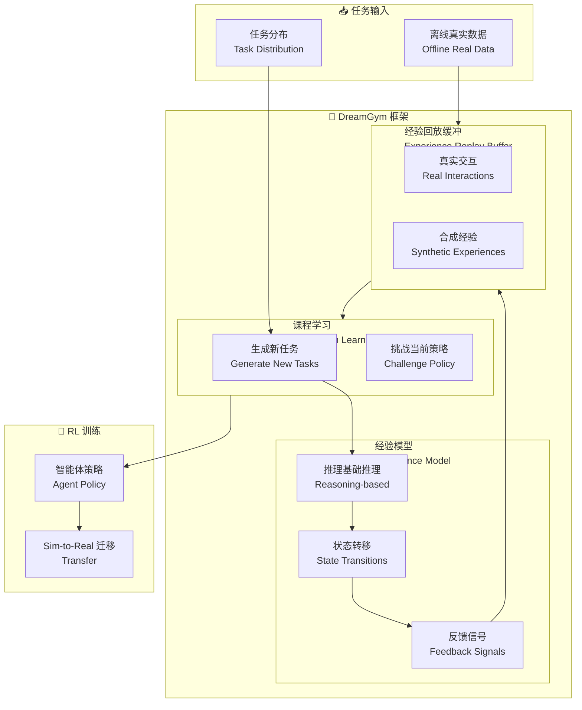

# Scaling Agent Learning via Experience Synthesis (DreamGym)

## 基本信息
- **标题**: Scaling Agent Learning via Experience Synthesis
- **中文标题**: 通过经验合成扩展智能体学习 (DreamGym)
- **arXiv**: [2511.03773](https://arxiv.org/abs/2511.03773)
- **机构**: UC Berkeley, Meta AI 等
- **发表日期**: 2025 年 11 月
- **基准测试**: WebArena, RL-ready 任务

## 论文综合评分
**综合评分**: ⭐⭐⭐⭐⭐ 4.8/5.0

| 维度 | 评分 | 说明 |
|------|------|------|
| 期刊影响力 | ⭐⭐⭐⭐⭐ | UC Berkeley, Meta AI, Dawn Song 等 |
| 问题核心性 | ⭐⭐⭐⭐⭐ | 直击 RL 智能体训练的核心挑战：昂贵 rollout |
| 方法创新性 | ⭐⭐⭐⭐⭐ | 首个统一框架合成多样化经验 |
| 技术壁垒 | ⭐⭐⭐⭐ | 需要推理基础经验模型和课程学习 |
| 落地可行性 | ⭐⭐⭐⭐⭐ | 适用于非 RL-ready 任务 |
| 应用前景 | ⭐⭐⭐⭐⭐ | Web 智能体、机器人等广泛应用 |

**综合评价**: DreamGym 提出了首个统一框架，通过合成多样化经验实现智能体在线 RL 训练。通过推理基础经验模型替代昂贵的真实环境 rollout，在 WebArena 上超越所有基线 30%+，在 RL-ready 任务上仅用合成交互即可匹配 GRPO 和 PPO 性能。为通用 RL 提供了可扩展的 warm-start 策略。

## 本体论映射 (Ontology Mapping)
基于 Agent Memory 领域本体模型的 7 维度标注

- **记忆类型**: Experiential Memory (经验记忆)
- **记忆结构**: Experience Replay Buffer (经验回放缓冲)
- **记忆操作**: Formation (经验合成) + Evolution (课程学习) + Retrieval (经验回放)
- **记忆载体**: Token-level (合成经验) + Vector (状态表示)
- **功能定位**: Scalable Agent RL Training (可扩展智能体 RL 训练)
- **使用模式**: Experience Synthesis + Curriculum Learning (经验合成 + 课程学习)
- **验证公理**: Experience Synthesis, Sim-to-Real Transfer

**领域贡献**: DreamGym 将**经验合成**引入智能体 RL 训练领域，提出了**推理基础经验模型**和**经验回放缓冲**。通过合成多样化经验替代真实 rollout，解决了 RL 训练的成本和可扩展性问题，实现了 sim-to-real 迁移。

## 核心主张（通俗易懂版）
- **🤔 问题是什么？** RL 智能体训练面临昂贵 rollout、任务多样性有限、奖励信号不可靠、基础设施复杂等挑战，阻碍可扩展经验数据收集。
- **💡 解决方案是什么？** DreamGym 提出首个统一框架，通过推理基础经验模型合成多样化经验，替代真实环境 rollout，支持在线 RL 训练和课程学习。
- **🌟 核心优势是什么？** WebArena +30% vs baselines，仅用合成交互匹配 GRPO/PPO 性能，sim-to-real 迁移显著减少真实交互需求。

## 方法架构
DreamGym 的核心创新在于推理基础经验模型和经验回放缓冲：

### 架构图

## 实验结果
在多个环境和智能体骨干上，DreamGym 显著提升了 RL 训练效果：

**关键发现**: DreamGym 通过合成经验实现了可扩展的 RL 训练，在非 RL-ready 任务上表现尤为突出。

### 主实验结果
**基准测试**: WebArena (非 RL-ready), RL-ready 任务

| 模型 | 方法 | WebArena | RL-ready 任务 | 说明 |
|------|------|----------|--------------|------|
| 基线 | 传统 RL | 基准 | 基准 | 真实 rollout |
| GRPO/PPO | 真实交互 | - | 100% | 高成本 |
| **DreamGym** | **合成经验** | **+30%** | **匹配** | **低成本** |
| Sim-to-Real | 合成→真实 | 显著增益 | 显著增益 | 减少真实交互 |

**关键数据**:
- WebArena: **超越所有基线 30%+**
- RL-ready 任务：**匹配 GRPO/PPO 性能** (仅合成交互)
- Sim-to-Real 迁移：**显著性能增益**
- 真实交互需求：**大幅减少**

### 核心优势
- **推理基础经验模型**: 替代昂贵 rollout
- **经验回放缓冲**: 初始化于离线数据，持续丰富
- **自适应课程学习**: 生成挑战性任务
- **Sim-to-Real 迁移**: 可扩展 warm-start 策略

**注**: 完整数据见论文实验部分

## 关键词
- 经验合成 (Experience Synthesis)
- 智能体 RL 训练 (Agent RL Training)
- 推理基础经验模型 (Reasoning-based Experience Model)
- 经验回放缓冲 (Experience Replay Buffer)
- 课程学习 (Curriculum Learning)
- Sim-to-Real 迁移 (Sim-to-Real Transfer)
- 可扩展 RL (Scalable RL)
- DreamGym

## 局限性分析
- **经验模型质量**: 依赖 LLM 的推理能力
- **领域适应性**: 不同领域可能需要不同的经验表示
- **冷启动问题**: 需要离线真实数据初始化
- **计算开销**: 推理基础模型增加计算成本

## 未来研究方向
- **更高效推理**: 优化经验模型的推理效率
- **无离线数据**: 研究无需离线数据的初始化方法
- **多智能体扩展**: 支持多智能体经验合成
- **跨领域迁移**: 研究经验在不同领域间的迁移
