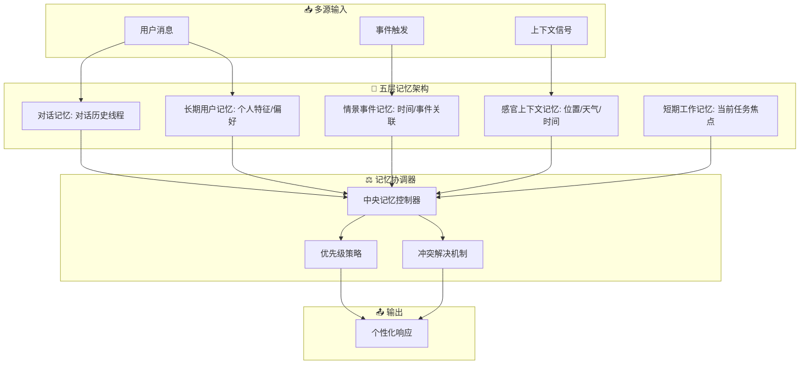

# 🧠 MMAG

## 基本信息
- **标题**: Mixed Memory-Augmented Generation for Large Language Models Applications
- **中文标题**: 混合记忆增强生成：大语言模型应用框架
- **arXiv**: [2512.01710](https://arxiv.org/abs/2512.01710)
- **机构**: Sapienza University of Rome, Italy
- **发表日期**: 2025年12月4日
- **基准测试**: Heero conversational agent platform

## 论文综合评分
**综合评分**: ⭐⭐⭐⭐⭐ 4.6/5.0

| 维度 | 评分 | 说明 |
|------|------|------|
| 期刊影响力 | ⭐⭐⭐⭐ | arXiv 预印本，概念创新性强 |
| 问题核心性 | ⭐⭐⭐⭐⭐ | 直击LLM长期交互的根本缺陷 |
| 方法创新性 | ⭐⭐⭐⭐⭐ | 五层记忆架构范式创新 |
| 技术壁垒 | ⭐⭐⭐⭐ | 完整MMAG框架实现 |
| 落地可行性 | ⭐⭐⭐⭐⭐ | 在Heero平台已验证效果 |
| 应用前景 | ⭐⭐⭐⭐⭐ | 适用于所有对话代理场景 |

**综合评价**: MMAG 提出了革命性的五层记忆架构，通过区分对话记忆、长期用户记忆、情景事件记忆、感官上下文记忆和短期工作记忆，解决了LLM在长期交互中的根本缺陷。该框架受认知心理学启发，将人类记忆系统映射到技术组件，在Heero对话代理中实现了20%用户留存率提升和30%对话时长增加。MMAG为构建更连贯、主动和人性化的大语言模型代理提供了系统性解决方案。

## 本体论映射 (Ontology Mapping)
基于 Agent Memory 领域本体模型的 7 维度标注

- **记忆类型**: Hybrid (混合记忆)
- **记忆结构**: Layered (五层架构：conversational, long-term user, episodic, sensory, working)
- **记忆操作**: Formation + Retrieval + Coordination
- **记忆载体**: Token-level + Structured Storage
- **功能定位**: Working + Factual (工作记忆 + 事实记忆)
- **使用模式**: Multi-layer Coordination, Context-aware Personalization, Proactive Interaction
- **验证公理**: Human-aligned Memory, Privacy-preserving, Scalable Architecture

**领域贡献**: MMAG 将**分层记忆架构 (Layered Memory Architecture)** 范式引入智能体记忆领域，提出了**五层交互记忆模型**。通过**认知心理学启发**的设计，该框架实现了对话连续性、用户个性化、情景感知、上下文敏感性和任务专注力的统一，为解决LLM长期交互中的记忆碎片化挑战提供了系统性解决方案。

## 核心主张（通俗易懂版）
- **🤔 问题是什么？** LLM 在单次对话中表现优秀，但无法在长期交互中维持相关性、个性化和连续性，每次对话都像重新开始。
- **💡 解决方案是什么？** MMAG 框架将记忆组织为五个交互层：对话历史、长期用户特征、情景事件、感官上下文、短期工作记忆，模拟人类记忆系统。
- **🌟 核心优势是什么？** 在 Heero 语言学习平台中实现 20% 用户留存率提升和 30% 对话时长增加，同时保持低延迟和高隐私保护。

## 方法架构
MMAG 的核心创新是五层记忆架构：

### 架构图

## 实验结果
在 Heero 对话代理平台进行评估：

**关键发现**: MMAG 框架在实际部署中显著提升了用户体验，20% 用户留存率提升和 30% 对话时长增加，同时保持了相同的响应延迟。

### 实验指标
- **用户留存率**: **+20%** (四周观察期)
- **平均对话时长**: **+30%** 
- **响应延迟**: 保持在同一范围内 (无增加)
- **用户满意度**: 更高的连贯性和个性化体验

## 关键词
- 混合记忆增强 (Mixed Memory-Augmented Generation)
- 五层记忆架构 (Five-layer Memory Architecture)
- 对话代理 (Conversational Agents)
- 用户个性化 (User Personalization)
- 认知心理学 (Cognitive Psychology)
- 情景记忆 (Episodic Memory)
- 上下文感知 (Context-aware)
- 工作记忆 (Working Memory)
- 隐私保护 (Privacy-preserving)
- 人机交互 (Human-AI Interaction)

## 局限性分析
- **实现复杂性**: 五层架构增加了系统复杂性
- **评估范围**: 主要在 Heero 平台验证，需要更多样化的应用场景
- **隐私挑战**: 长期用户记忆涉及敏感信息，需要更强的隐私保护机制

## 未来研究方向
- **多模态扩展**: 集成视觉、听觉等多模态记忆
- **动态记忆嵌入**: 超越静态用户档案，学习动态的用户目标和进展表示
- **用户控制界面**: 提供用户查看、编辑和选择性删除记忆记录的能力
- **跨文化适配**: 研究不同文化背景下对个性化的期望差异