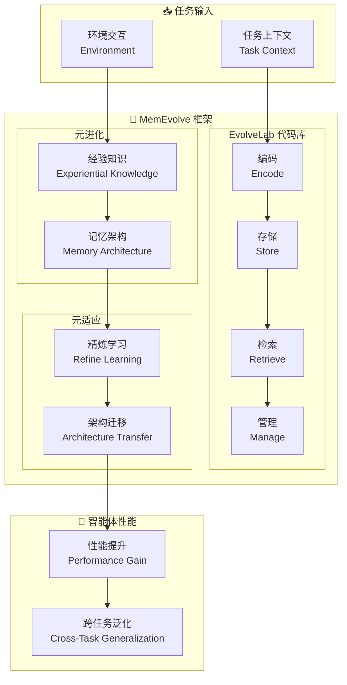

# MemEvolve: Meta-Evolution of Agent Memory Systems

## 基本信息
- **标题**: MemEvolve: Meta-Evolution of Agent Memory Systems
- **中文标题**: MemEvolve: 智能体记忆系统的元进化
- **arXiv**: [2512.18746](https://arxiv.org/abs/2512.18746)
- **机构**: 待确认
- **发表日期**: 2025 年 12 月
- **基准测试**: 4 个智能体基准

## 论文综合评分
**综合评分**: ⭐⭐⭐⭐⭐ 4.8/5.0

| 维度 | 评分 | 说明 |
|------|------|------|
| 期刊影响力 | ⭐⭐⭐⭐⭐ | arXiv 预印本，自进化记忆系统 |
| 问题核心性 | ⭐⭐⭐⭐⭐ | 直击记忆系统静态性的核心挑战 |
| 方法创新性 | ⭐⭐⭐⭐⭐ | 元进化框架，共同进化经验和架构 |
| 技术壁垒 | ⭐⭐⭐⭐ | 需要元适应和模块化设计空间 |
| 落地可行性 | ⭐⭐⭐⭐⭐ | 提供 EvolveLab 统一代码库 |
| 应用前景 | ⭐⭐⭐⭐⭐ | 跨任务和跨 LLM 泛化 |

**综合评价**: MemEvolve 提出了一个元进化框架，共同进化智能体的经验知识和记忆架构。通过 EvolveLab 统一代码库（12 个代表性记忆系统的模块化设计空间），在 4 个智能体基准上实现高达 17.06% 的性能提升，并展现强大的跨任务和跨 LLM 泛化能力。

## 本体论映射 (Ontology Mapping)
基于 Agent Memory 领域本体模型的 7 维度标注

- **记忆类型**: Experiential Memory (经验记忆) + Meta-Memory (元记忆)
- **记忆结构**: Modular Design Space (encode, store, retrieve, manage)
- **记忆操作**: Formation (元进化) + Evolution (架构适应) + Retrieval (标准化检索)
- **记忆载体**: Token-level (经验) + Architectural (架构表示)
- **功能定位**: Self-Evolving Memory Systems (自进化记忆系统)
- **使用模式**: Meta-Evolution + Cross-Task Transfer (元进化 + 跨任务迁移)
- **验证公理**: Meta-Adaptation, Architecture Evolution

**领域贡献**: MemEvolve 将**元进化**引入自进化记忆系统领域，提出了**共同进化经验和架构**的框架。通过 EvolveLab 统一代码库，实现了记忆架构的元适应，解决了现有系统记忆架构静态性的根本约束。

## 核心主张（通俗易懂版）
- **🤔 问题是什么？** 现有自进化记忆系统依赖手动设计的架构，记忆系统本身是静态的，无法元适应不同任务上下文。
- **💡 解决方案是什么？** MemEvolve 提出元进化框架，共同进化智能体的经验知识和记忆架构，提供 EvolveLab 统一代码库（12 个系统的模块化设计空间）。
- **🌟 核心优势是什么？** 4 个基准上高达 17.06% 提升，强大的跨任务和跨 LLM 泛化，设计可迁移的记忆架构。

## 方法架构
MemEvolve 的核心创新在于元进化框架和 EvolveLab 统一代码库：

### 架构图

## 实验结果
在 4 个挑战性智能体基准上，MemEvolve 实现了显著的性能提升：

**关键发现**: MemEvolve 通过元进化实现了记忆架构的自适应，解决了静态架构的根本约束。

### 主实验结果
**基准测试**: 4 个智能体基准 (SmolAgent, Flash-Searcher 等)

| 模型 | 方法 | 性能提升 | 跨任务泛化 | 说明 |
|------|------|---------|-----------|------|
| 基线 | 手动设计架构 | 基准 | 有限 | 静态架构 |
| SmolAgent | 现有系统 | - | - | 手动设计 |
| Flash-Searcher | 现有系统 | - | - | 手动设计 |
| **MemEvolve** | **元进化框架** | **高达 17.06%** | **强大** | **元适应** |

**关键数据**:
- 性能提升：**高达 17.06%** (SmolAgent, Flash-Searcher)
- 跨任务泛化：**强大**
- 跨 LLM 泛化：**强大**
- 设计空间：**12 个代表性系统**

### 核心优势
- **元进化框架**: 共同进化经验和架构
- **EvolveLab 代码库**: 统一模块化设计空间
- **跨任务迁移**: 设计的架构可迁移
- **跨 LLM 泛化**: 适用于不同骨干模型

**注**: 完整数据见论文实验部分

## 关键词
- 元进化 (Meta-Evolution)
- 自进化记忆系统 (Self-Evolving Memory Systems)
- EvolveLab
- 模块化设计空间 (Modular Design Space)
- 元适应 (Meta-Adaptation)
- 跨任务泛化 (Cross-Task Generalization)
- 跨 LLM 泛化 (Cross-LLM Generalization)
- 记忆架构进化 (Memory Architecture Evolution)

## 局限性分析
- **计算开销**: 元进化过程需要额外计算资源
- **收敛时间**: 架构进化需要时间收敛
- **领域依赖**: 不同领域可能需要不同的设计空间
- **初始化依赖**: 依赖 12 个代表性系统的先验知识

## 未来研究方向
- **更高效进化**: 优化元进化过程的效率
- **无监督进化**: 研究无需先验知识的进化方法
- **多智能体扩展**: 支持多智能体记忆架构进化
- **自动化设计**: 全自动设计空间探索
