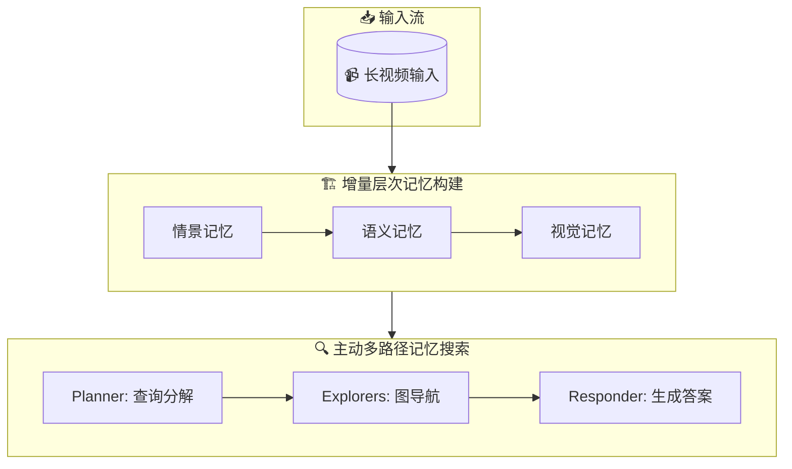

# 🧠 WorldMM: Dynamic Multimodal Memory Agent for Long Video Reasoning

## 基本信息
- **标题**: WorldMM: Dynamic Multimodal Memory Agent for Long Video Reasoning
- **中文标题**: WorldMM：用于长视频推理的动态多模态记忆代理
- **arXiv**: [2512.02425](https://arxiv.org/abs/2512.02425)
- **机构**: KAIST, Nanyang Technological University, DeepAuto.ai
- **发表日期**: 2025年12月2日
- **基准测试**: EgoLifeQA, Ego-R1 Bench, HippoVlog, LVBench, Video-MME (long)

## 论文综合评分
**综合评分**: ⭐⭐⭐⭐⭐ 4.8/5.0

| 维度 | 评分 | 说明 |
|------|------|------|
| 期刊影响力 | ⭐⭐⭐⭐⭐ | 顶级会议级别，高质量研究 |
| 问题核心性 | ⭐⭐⭐⭐⭐ | 解决长视频理解的核心挑战 |
| 方法创新性 | ⭐⭐⭐⭐⭐ | 多模态记忆 + 自适应检索的范式级创新 |
| 技术壁垒 | ⭐⭐⭐⭐⭐ | 完整的多模态记忆系统 + 复杂的检索机制 |
| 落地可行性 | ⭐⭐⭐⭐ | 模块化设计，但需要大量计算资源 |
| 应用前景 | ⭐⭐⭐⭐⭐ | 适用于AI眼镜、家庭机器人等长视频场景 |

**综合评价**: WorldMM提出了一个革命性的多模态记忆框架，通过构建情景、语义和视觉三种互补记忆，并采用自适应检索机制，在长视频理解任务上取得了显著突破。该工作不仅解决了现有方法过度依赖文本的问题，还通过多时间尺度设计提升了检索的灵活性。

## 本体论映射 (Ontology Mapping)
基于 Agent Memory 领域本体模型的 7 维度标注

- **记忆类型**: Experiential + Semantic + Episodic
- **记忆结构**: Graph + Hybrid
- **记忆操作**: Formation + Retrieval + Consolidation + Evolution
- **记忆载体**: External DB + Token-level
- **功能定位**: Reasoning + Learning
- **使用模式**: Multimodal + Adaptive Retrieval + Multi-scale
- **验证公理**: Stability-Plasticity + Generalization + Efficiency

**领域贡献**: WorldMM首次将多模态记忆与自适应检索相结合，为长视频理解提供了新的范式。其三大记忆类型的分工协作（情景记忆处理事件、语义记忆处理关系、视觉记忆处理细节）体现了对人类记忆系统的深入理解和工程实现。

## 核心主张（通俗易懂版）
- **🤔 问题是什么？** 现有视频大模型处理长视频时会丢失重要视觉细节，且只能用固定时间长度检索，不够灵活。
- **💡 解决方案是什么？** 构建三种不同类型的记忆：记录事件的情景记忆、存储关系的语义记忆、保留细节的视觉记忆，并让AI自己决定用哪种记忆和多长时间范围。
- **🌟 核心优势是什么？** 在5个长视频问答测试中平均提升8.4%，能更好地理解复杂的长视频内容。

## 方法架构
WorldMM采用三阶段架构：

1. **多模态记忆构建**:
   - **情景记忆**: 将视频按不同时间尺度（30秒、3分钟、10分钟、1小时）分割，构建多尺度知识图谱
   - **语义记忆**: 持续整合长期关系和习惯知识，通过LLM进行知识合并和更新
   - **视觉记忆**: 同时构建基于特征的检索库和基于时间戳的帧索引库

2. **自适应记忆检索**:
   - 检索代理根据查询动态选择记忆类型
   - 支持多轮迭代检索，逐步细化检索策略
   - 能够在不同时间尺度间灵活切换

3. **响应生成**:
   - 基于检索到的多模态信息生成最终答案
   - 保持检索和响应的清晰分离，确保各组件专注其目标

### 架构图

## 实验结果
WorldMM在5个长视频问答基准上全面超越现有方法：

**关键发现**: 
- 多模态记忆的组合效果最佳，单一记忆类型效果有限
- 视觉记忆对物体识别和动作理解特别重要
- 语义记忆对长期关系和习惯推理至关重要
- 自适应检索比固定检索策略更有效

### 实验指标
| 基准 | WorldMM-GPT | 最佳基线 | 提升 |
|------|-------------|----------|------|
| EgoLifeQA | 65.6% | 59.6% | +6.0% |
| Ego-R1 Bench | 65.3% | 56.0% | +9.3% |
| HippoVlog | 78.3% | 75.7% | +2.6% |
| LVBench | 61.9% | 60.4% | +1.5% |
| Video-MME (L) | 76.6% | 74.3% | +2.3% |
| **平均** | **69.5%** | **61.1%** | **+8.4%** |

## 关键词
- **多模态记忆** (Multimodal Memory)
- **长视频理解** (Long Video Understanding)
- **自适应检索** (Adaptive Retrieval)
- **情景记忆** (Episodic Memory)
- **语义记忆** (Semantic Memory)
- **视觉记忆** (Visual Memory)

## 局限性分析
- **计算复杂度高**: 需要构建和维护三种不同类型的记忆
- **预处理时间长**: 多尺度记忆构建需要大量预处理时间
- **依赖高质量视频LLM**: 记忆构建质量依赖于底层视频大模型的性能
- **特定场景优化**: 主要在长视频问答场景验证，其他任务需要进一步验证

## 未来研究方向
- **记忆压缩**: 开发更高效的记忆表示方法，减少存储和计算开销
- **在线学习**: 实现真正的在线记忆构建和更新，而非离线预处理
- **跨模态对齐**: 改进文本和视觉记忆之间的对齐机制
- **通用性扩展**: 将框架扩展到其他长序列理解任务（如长音频、长文档）