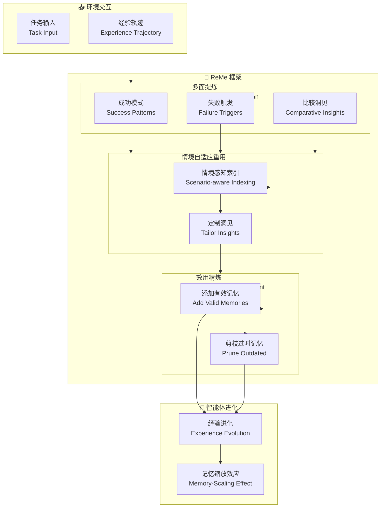

# Remember Me, Refine Me (ReMe): A Dynamic Procedural Memory Framework for Experience-Driven Agent Evolution

## 基本信息
- **标题**: Remember Me, Refine Me: A Dynamic Procedural Memory Framework for Experience-Driven Agent Evolution
- **中文标题**: 记住我，精炼我：经验驱动智能体进化的动态过程记忆框架
- **arXiv**: [2512.10696](https://arxiv.org/abs/2512.10696)
- **机构**: 待确认
- **发表日期**: 2025 年 12 月
- **基准测试**: BFCL-V3, AppWorld

## 论文综合评分
**综合评分**: ⭐⭐⭐⭐⭐ 4.8/5.0

| 维度 | 评分 | 说明 |
|------|------|------|
| 期刊影响力 | ⭐⭐⭐⭐⭐ | arXiv 预印本，过程记忆系统 |
| 问题核心性 | ⭐⭐⭐⭐⭐ | 直击过程记忆的被动积累核心挑战 |
| 方法创新性 | ⭐⭐⭐⭐⭐ | 三机制创新：多面提炼、情境自适应、效用精炼 |
| 技术壁垒 | ⭐⭐⭐⭐ | 需要细粒度经验提取和自主精炼 |
| 落地可行性 | ⭐⭐⭐⭐⭐ | 提供代码和数据集 |
| 应用前景 | ⭐⭐⭐⭐⭐ | 终身学习、计算高效路径 |

**综合评价**: ReMe 提出了一个全面的过程记忆框架，通过三机制创新（多面提炼、情境自适应重用、效用精炼）实现了经验驱动的智能体进化。在 BFCL-V3 和 AppWorld 上达到 SOTA，发现记忆缩放效应：Qwen3-8B + ReMe 超越无记忆的 Qwen3-14B，为终身学习提供了计算高效的路径。

## 本体论映射 (Ontology Mapping)
基于 Agent Memory 领域本体模型的 7 维度标注

- **记忆类型**: Procedural Memory (过程记忆) + Experiential Memory (经验记忆)
- **记忆结构**: Dynamic Experience Pool (动态经验池)
- **记忆操作**: Formation (多面提炼) + Evolution (效用精炼) + Retrieval (情境自适应)
- **记忆载体**: Token-level (过程知识) + Structured (情境索引)
- **功能定位**: Experience-Driven Agent Evolution (经验驱动智能体进化)
- **使用模式**: Multi-faceted Distillation + Utility-based Refinement (多面提炼 + 效用精炼)
- **验证公理**: Memory-Scaling Effect, Self-Evolving Memory

**领域贡献**: ReMe 将**动态过程记忆**引入智能体进化领域，提出了**三机制生命周期管理**。通过多面提炼、情境自适应重用和效用精炼，解决了被动积累的根本约束，发现了记忆缩放效应，为终身学习提供了计算高效的路径。

## 核心主张（通俗易懂版）
- **🤔 问题是什么？** 现有过程记忆框架遭受"被动积累"范式，将记忆视为静态的只增归档，无法动态推理。
- **💡 解决方案是什么？** ReMe 提出三机制：多面提炼（提取细粒度经验）、情境自适应重用（情境感知索引）、效用精炼（自主添加/剪枝）。
- **🌟 核心优势是什么？** BFCL-V3 和 AppWorld SOTA，记忆缩放效应：Qwen3-8B + ReMe 超越 Qwen3-14B (无记忆)。

## 方法架构
ReMe 的核心创新在于三机制过程记忆生命周期管理：

### 架构图

## 实验结果
在 BFCL-V3 和 AppWorld 上，ReMe 达到了智能体记忆系统的 SOTA：

**关键发现**: ReMe 通过动态过程记忆实现了经验驱动的智能体进化，发现了记忆缩放效应。

### 主实验结果
**基准测试**: BFCL-V3, AppWorld

| 模型 | 方法 | BFCL-V3 | AppWorld | 说明 |
|------|------|---------|----------|------|
| Qwen3-14B | 无记忆 | 基准 | 基准 | 大模型 |
| Qwen3-8B | 无记忆 | 较低 | 较低 | 小模型 |
| **Qwen3-8B + ReMe** | **过程记忆** | **SOTA** | **SOTA** | **超越 14B** |

**关键数据**:
- BFCL-V3: **SOTA**
- AppWorld: **SOTA**
- 记忆缩放效应：**Qwen3-8B + ReMe > Qwen3-14B (无记忆)**
- 计算效率：**终身学习的高效路径**

### 核心优势
- **多面提炼**: 细粒度经验提取
- **情境自适应**: 情境感知索引
- **效用精炼**: 自主添加/剪枝
- **记忆缩放**: 小模型 + 记忆 > 大模型

**注**: 完整数据见论文 Table (9 个表格)

## 关键词
- 过程记忆 (Procedural Memory)
- 经验驱动进化 (Experience-Driven Evolution)
- 多面提炼 (Multi-faceted Distillation)
- 情境自适应重用 (Context-Adaptive Reuse)
- 效用精炼 (Utility-based Refinement)
- 记忆缩放效应 (Memory-Scaling Effect)
- 自进化记忆 (Self-Evolving Memory)
- ReMe

## 局限性分析
- **提炼质量**: 依赖 LLM 的细粒度分析能力
- **情境匹配**: 情境感知索引需要精确匹配
- **剪枝策略**: 效用评估可能需要人工定义
- **计算开销**: 三机制增加计算成本

## 未来研究方向
- **更高效提炼**: 优化多面提炼的效率
- **自动化情境**: 研究自动情境感知方法
- **自适应剪枝**: 学习效用评估策略
- **多智能体扩展**: 支持多智能体经验共享
