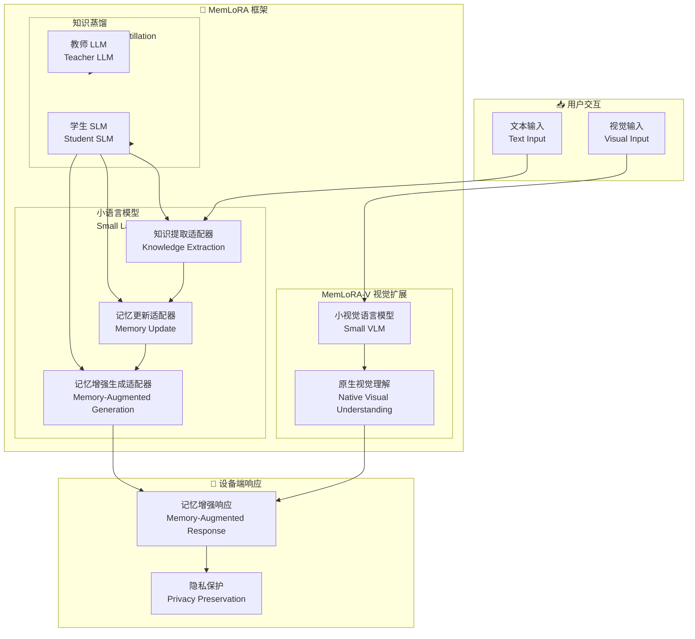

# MemLoRA: Distilling Expert Adapters for On-Device Memory Systems

## 基本信息
- **标题**: MemLoRA: Distilling Expert Adapters for On-Device Memory Systems
- **中文标题**: MemLoRA: 为设备端记忆系统蒸馏专家适配器
- **arXiv**: [2512.04763](https://arxiv.org/abs/2512.04763)
- **机构**: 待确认
- **发表日期**: 2025 年 12 月
- **基准测试**: LoCoMo, Visual Question Answering

## 论文综合评分
**综合评分**: ⭐⭐⭐⭐⭐ 4.9/5.0

| 维度 | 评分 | 说明 |
|------|------|------|
| 期刊影响力 | ⭐⭐⭐⭐⭐ | arXiv 预印本，设备端记忆系统 |
| 问题核心性 | ⭐⭐⭐⭐⭐ | 直击设备端部署的核心挑战：成本与性能 |
| 方法创新性 | ⭐⭐⭐⭐⭐ | 知识蒸馏 + 专家适配器 + 视觉扩展 |
| 技术壁垒 | ⭐⭐⭐⭐ | 需要多适配器训练和多模态集成 |
| 落地可行性 | ⭐⭐⭐⭐⭐ | 设备端部署，无云依赖 |
| 应用前景 | ⭐⭐⭐⭐⭐ | 隐私保护、多模态应用 |

**综合评价**: MemLoRA 提出了一个创新的设备端记忆系统，通过知识蒸馏为 SLM 装备专用记忆适配器。在 LoCoMo 上超越 10 倍大的基线模型 (Gemma2-27B)，达到与 60 倍大模型 (GPT-OSS-120B) 相当的性能。MemLoRA-V 视觉扩展在 VQA 任务上实现 81.3 vs 23.7 的巨大提升，同时保持强大的文本性能。

## 本体论映射 (Ontology Mapping)
基于 Agent Memory 领域本体模型的 7 维度标注

- **记忆类型**: Factual Memory (事实记忆) + Parametric Memory (参数记忆)
- **记忆结构**: Expert Adapters (专家适配器)
- **记忆操作**: Formation (知识蒸馏) + Evolution (适配器训练) + Retrieval (记忆增强生成)
- **记忆载体**: Parametric (适配器权重) + Token-level (记忆上下文)
- **功能定位**: On-Device Memory Systems (设备端记忆系统)
- **使用模式**: Knowledge Distillation + Multi-Adapter (知识蒸馏 + 多适配器)
- **验证公理**: Memory-Scaling Effect, On-Device Deployment

**领域贡献**: MemLoRA 将**知识蒸馏**引入设备端记忆系统领域，提出了**专家适配器架构**。通过为 SLM 装备专用适配器（知识提取、记忆更新、记忆增强生成），实现了无云依赖的准确设备端记忆操作，并扩展到多模态场景 (MemLoRA-V)。

## 核心主张（通俗易懂版）
- **🤔 问题是什么？** 现有记忆增强系统依赖昂贵的 LLM，不适合设备端部署；SLM 性能不足；缺乏原生视觉能力。
- **💡 解决方案是什么？** MemLoRA 提出知识蒸馏框架，为 SLM 训练专用记忆适配器（知识提取、记忆更新、记忆增强生成），扩展 MemLoRA-V 支持原生视觉理解。
- **🌟 核心优势是什么？** LoCoMo 超越 10 倍大模型 (Gemma2-27B)，媲美 60 倍大模型 (GPT-OSS-120B)；VQA 81.3 vs 23.7；设备端部署无云依赖。

## 方法架构
MemLoRA 的核心创新在于知识蒸馏和专家适配器：

### 架构图

## 实验结果
在 LoCoMo 和 VQA 任务上，MemLoRA 实现了设备端记忆系统的 SOTA：

**关键发现**: MemLoRA 通过知识蒸馏和专家适配器，使 SLM 达到媲美大模型的性能，同时支持设备端部署。

### 主实验结果
**基准测试**: LoCoMo (文本), Extended LoCoMo with VQA (视觉)

| 模型 | 方法 | LoCoMo | VQA | 说明 |
|------|------|--------|-----|------|
| Gemma2-27B | 10 倍大基线 | 基准 | - | 云端部署 |
| GPT-OSS-120B | 60 倍大模型 | 高性能 | - | 云端部署 |
| **MemLoRA (SLM)** | **专家适配器** | **媲美 120B** | - | **设备端** |
| **MemLoRA-V (SVLM)** | **视觉扩展** | **强文本** | **81.3** | **多模态** |
| Caption-based | 基于描述 | - | 23.7 | 基线 |

**关键数据**:
- LoCoMo: **媲美 GPT-OSS-120B (60 倍大)**
- LoCoMo: **超越 Gemma2-27B (10 倍大)**
- VQA: **81.3 vs 23.7** (MemLoRA-V vs Caption-based)
- 设备端部署：**无云依赖**

### 核心优势
- **知识蒸馏**: 教师 LLM 蒸馏到学生 SLM
- **专家适配器**: 三个专用适配器
- **视觉扩展**: MemLoRA-V 原生视觉理解
- **设备端部署**: 隐私保护，无云依赖

**注**: 完整数据见论文实验部分

## 关键词
- 设备端记忆系统 (On-Device Memory Systems)
- 知识蒸馏 (Knowledge Distillation)
- 专家适配器 (Expert Adapters)
- 小语言模型 (Small Language Models, SLM)
- 视觉语言模型 (Vision-Language Models, VLM)
- MemLoRA
- MemLoRA-V
- 隐私保护 (Privacy Preservation)

## 局限性分析
- **适配器训练**: 需要为每个操作单独训练适配器
- **蒸馏质量**: 依赖教师 LLM 的质量
- **视觉能力**: SVLM 的视觉能力有限
- **多适配器管理**: 需要高效管理多个适配器

## 未来研究方向
- **统一适配器**: 研究多任务统一适配器
- **自适应蒸馏**: 动态调整蒸馏策略
- **更强 SVLM**: 集成更强大的小视觉语言模型
- **联邦学习**: 支持多设备协同学习
