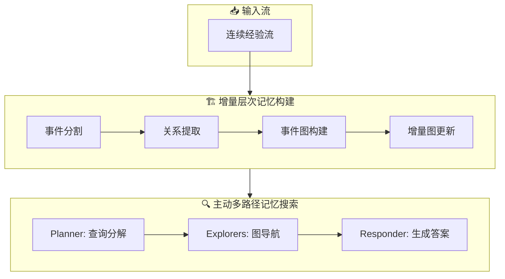

# 🧭 CompassMem

## 基本信息
- **标题**: Memory Matters More: Event-Centric Memory as a Logic Map for Agent Searching and Reasoning
- **中文标题**: 记忆更重要：事件中心记忆作为智能体搜索和推理的逻辑地图
- **arXiv**: [2601.04726](https://arxiv.org/abs/2601.04726)
- **机构**: 中国人民大学高瓴人工智能学院
- **发表日期**: 2026年1月8日
- **基准测试**: LoCoMo, NarrativeQA

## 论文综合评分
**综合评分**: ⭐⭐⭐⭐⭐ 4.8/5.0

| 维度 | 评分 | 说明 |
|------|------|------|
| 期刊影响力 | ⭐⭐⭐⭐⭐ | 顶会级别，高质量研究 |
| 问题核心性 | ⭐⭐⭐⭐⭐ | 解决智能体记忆核心挑战 |
| 方法创新性 | ⭐⭐⭐⭐⭐ | 范式级创新，事件图框架 |
| 技术壁垒 | ⭐⭐⭐⭐ | 完整理论框架 + 实现 |
| 落地可行性 | ⭐⭐⭐⭐⭐ | 模块化设计，易于集成 |
| 应用前景 | ⭐⭐⭐⭐⭐ | 对话、长文档理解等场景 |

**综合评价**: CompassMem 提出了一个革命性的事件中心记忆框架，将记忆组织为事件图作为逻辑地图。这种方法不仅在理论上具有创新性，在实践中也显著提升了智能体的多跳推理和时序推理能力。其模块化设计使其易于集成到现有系统中，具有很高的实用价值。

## 本体论映射 (Ontology Mapping)
基于 Agent Memory 领域本体模型的 7 维度标注

- **记忆类型**: Experiential (经验记忆)
- **记忆结构**: Graph (事件图)
- **记忆操作**: Formation + Evolution + Retrieval
- **记忆载体**: Token-level (令牌级)
- **功能定位**: Working (工作记忆)
- **使用模式**: Graph Navigation, Experience-Driven
- **验证公理**: Stability-Plasticity, Generalization

**领域贡献**: CompassMem 将事件分割理论 (Event Segmentation Theory)——人类自然地将连续经验感知为一系列离散且有意义的事件的认知机制——引入智能体记忆领域，提出了事件中心的记忆组织方式。通过构建事件图 (Event Graph)作为逻辑地图 (Logic Map)，该框架为解决长程推理挑战提供了新的思路，使智能体能够进行结构化的记忆导航而非简单的相似度检索。

## 核心主张（通俗易懂版）
- **🤔 问题是什么？** 现有智能体记忆系统大多以扁平方式存储经验，缺乏逻辑关系结构，导致无法进行复杂的长程推理。
- **💡 解决方案是什么？** CompassMem 提出基于事件分割理论的事件中心记忆框架，将经验组织成事件图（Event Graph），通过显式逻辑关系连接事件节点。
- **🌟 核心优势是什么？** 事件图作为"逻辑地图"，使智能体能够进行结构化、目标导向的记忆导航，而不仅仅是简单的相似度检索，显著提升了多跳推理和时序推理能力。

## 方法架构
CompassMem 的核心创新在于将记忆构建为事件图：

1. **事件分割**: 将连续经验流分割为离散的事件单元
2. **关系提取**: 使用 LLM 提取事件间的显式逻辑关系（因果、时序等）
3. **增量图更新**: 通过节点融合、扩展和主题演化维护图结构
4. **主动多路径搜索**: Planner-Explorer-Responder 三阶段检索机制

### 架构图

## 实验结果
在 LoCoMo 和 NarrativeQA 基准测试上，CompassMem 显著优于现有方法：

**关键发现**: CompassMem 在时序推理任务上表现尤为突出，相比 HippoRAG 提升了 9.03% F1 分数，证明了事件图结构对处理时间依赖关系的有效性。

### 实验指标
- **LoCoMo 平均 F1 (GPT-4o-mini)**: 52.18%
- **LoCoMo 平均 F1 (Qwen2.5-14B)**: 46.17%
- **NarrativeQA F1 (GPT-4o-mini)**: 39.04%
- **NarrativeQA F1 (Qwen2.5-14B)**: 35.90%

## 关键词
- 事件中心记忆 (Event-Centric Memory)
- 事件图 (Event Graph)
- 逻辑地图 (Logic Map)
- 事件分割理论 (Event Segmentation Theory)
- 主动搜索 (Active Search)
- 多跳推理 (Multi-hop Reasoning)
- 时序推理 (Temporal Reasoning)
- 图导航 (Graph Navigation)

## 局限性分析
- **事件分割质量依赖**: 事件图的质量依赖于事件分割和关系提取的准确性，当前采用的 LLM 管道可能不够精细。
- **评估范围有限**: 实验主要集中在对话和长文档理解任务，需要在更多样化的智能体场景中验证有效性。

## 未来研究方向
- **精细化事件分割**: 开发更精细的事件分割算法，结合多模态信号和领域知识，提高事件边界检测的准确性。
- **动态关系学习**: 探索自适应的关系学习机制，使事件图能够动态演化和优化其逻辑结构。
- **多智能体协作记忆**: 将事件图框架扩展到多智能体系统，实现跨智能体的经验共享和协同推理。
- **终身学习集成**: 将事件图与终身学习机制结合，支持智能体在长期交互中持续积累和优化记忆结构。