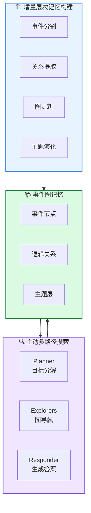

# CompassMem: 事件中心记忆作为逻辑地图

**Memory Matters More: Event-Centric Memory as a Logic Map for Agent Searching and Reasoning**

---

## 📄 论文信息

| 项目 | 内容 |
|------|------|
| **arXiv** | 2601.04726 |
| **日期** | 2026 年 1 月 |
| **机构** | 中国人民大学高瓴人工智能学院 |
| **基准** | LoCoMo / NarrativeQA |
| **评分** | ⭐⭐⭐⭐⭐ 4.8/5.0 |

---

## 🔗 本体论映射

基于 Agent Memory 领域本体模型的 7 维度标注：

| 维度 | 标注 |
|------|------|
| **📦 记忆类型** | 情景式 (Episodic) |
| **🏗️ 记忆结构** | 图式 (Graph) + 层次化 (Hierarchical) |
| **⚙️ 记忆操作** | 形成 (Formation) + 检索 (Retrieval) + 演化 (Evolution) |
| **💾 记忆载体** | 外部数据库 (事件图) |
| **🎯 功能类型** | 推理 + 规划 |
| **🔁 使用模式** | 图导航 + 主动多路径搜索 |
| **✅ 验证公理** | 效率 + 可解释性 |

---

## 🎯 核心主张

### 🤔 问题是什么？

现有记忆系统采用扁平化存储和基于相似度的检索，无法显式捕捉经验间的逻辑关系（如因果、时序），导致记忆只能作为被动存储而非主动指导推理的基础设施。

### 💡 解决方案是什么？

CompassMem 受事件分割理论启发，将记忆组织为事件图 (Event Graph)，通过显式逻辑关系连接事件单元，使记忆成为指导智能体搜索和推理的逻辑地图。

### 🌟 核心优势是什么？

① 事件级细粒度表示保留叙事结构 ② 显式逻辑关系支持多跳推理 ③ 主动多路径搜索超越被动检索 ④ LoCoMo 平均 F1 +4.26%，时序推理 +9.03%

---

## 💡 关键洞见

> 记忆不应只是被动存储，而应作为主动的逻辑地图指导推理过程。通过事件图和逻辑关系，智能体可以沿着有意义的逻辑路径导航，而非依赖扁平的相似度检索。

---

## 📐 方法架构

CompassMem 包含增量层次记忆构建和主动多路径记忆搜索两大模块。

### 🏗️ 增量层次记忆构建

- **事件分割**: 基于事件分割理论 (EST)，将连续经验流分割为离散且连贯的事件单元
- **关系提取**: 显式提取事件间的逻辑关系（因果、时序、动机、部分 - 整体）
- **图更新**: 节点融合与扩展，避免冗余和语义漂移
- **主题演化**: K-means 聚类 + 在线更新，定期重新聚类防止语义漂移

### 🔍 主动多路径记忆搜索

- **Planner**: 将查询分解为 2-5 个子目标，维护满足向量，指导探索方向
- **Explorers**: 多个 Explorer 并行在事件图上导航，决定跳过/扩展/回答
- **Responder**: 当所有子目标满足时生成最终答案
- **协调机制**: 基于未满足子目标的相似度调度候选节点，减少冗余探索

---

## 📈 实验结果

### LoCoMo 主结果 (GPT-4o-mini)

| 方法 | 单跳 F1 | 多跳 F1 | 开放域 F1 | 时序 F1 | 平均 F1 |
|------|--------|--------|----------|--------|--------|
| RAG | 52.19 | 32.17 | 23.21 | 30.77 | 42.25 |
| Mem0 | 47.65 | 38.72 | 28.64 | 48.93 | 45.10 |
| HippoRAG | 54.84 | 33.59 | 28.59 | 48.17 | 47.92 |
| A-Mem | 44.65 | 27.02 | 12.14 | 45.85 | 39.65 |
| CAM | 50.58 | 33.55 | 18.23 | 44.14 | 44.10 |
| **CompassMem** | **57.36** | **38.84** | **26.61** | **57.96** | **52.18** |

**关键发现**: CompassMem 在 LoCoMo 上平均 F1 达到 52.18%，超越最强基线 HippoRAG (47.92%) 4.26 个百分点。时序推理提升最显著 (57.96% vs 48.93% +9.03%)，证明事件图对时序关系建模的优势。

### NarrativeQA 结果

| 模型 | 方法 | F1 | BLEU |
|------|------|----|----|
| GPT-4o-mini | RAG | 28.99 | 25.68 |
| GPT-4o-mini | CAM | 33.55 | 29.74 |
| **GPT-4o-mini** | **CompassMem** | **39.04** | **35.23** |
| Qwen2.5-14B | RAG | 25.82 | 20.65 |
| Qwen2.5-14B | CAM | 27.87 | 23.47 |
| **Qwen2.5-14B** | **CompassMem** | **35.90** | **28.66** |

在 NarrativeQA 上，CompassMem 超越最强基线 CAM 超过 5-8% F1，证明事件中心记忆在长文档叙事理解上的有效性。

### 效率分析

- **记忆构建时间**: 显著低于 Mem0, A-Mem, MemoryOS
- **总处理时间**: 与 Mem0 和 A-Mem 相当，显著低于 MemoryOS
- **每问题延迟**: 与 Mem0 和 A-Mem 相当
- **Token 消耗**: 较高，但伴随显著性能提升

---

## ✅ 验证的领域公理

### 效率公理
记忆构建时间低于 Mem0、A-Mem、MemoryOS，每问题延迟相当，证明事件图构建的高效性。

### 可解释性公理
事件图提供显式逻辑结构，支持路径追踪和证据溯源，相比扁平检索更具可解释性。主动多路径搜索过程透明，可追踪探索路径。

---

## ⚠️ 局限性

1. **事件分割质量依赖 LLM**: 当前采用简单的 LLM 管道进行事件分割和关系提取，更细粒度和鲁棒的分割方法可能进一步提升记忆质量
2. **评估范围有限**: 评估集中在 LoCoMo 和 NarrativeQA 两个基准，需要在更广泛的任务和智能体设置中验证适用性
3. **Token 消耗较高**: 虽然构建时间低，但 CompassMem 使用更多 tokens（事件提取、关系提取、多路径探索），成本效益需进一步优化

---

## 🔮 未来工作方向

1. 探索更鲁棒的事件分割算法，减少对 LLM 的依赖
2. 扩展到更多任务类型（代码生成、创意写作、多模态）
3. 优化 token 使用效率，研究事件图压缩技术
4. 研究离线构建高质量记忆结构，支持轻量级在线搜索

---

## 🏷️ 关键词

- 事件中心记忆 (Event-Centric Memory)
- 事件分割理论 (Event Segmentation Theory)
- 事件图 (Event Graph)
- 逻辑关系 (Logical Relations)
- 主动导航 (Active Navigation)
- 多路径搜索 (Multi-Path Search)
- 长程推理 (Long-Horizon Reasoning)
- 主题演化 (Topic Evolution)

---

## 📚 专业名词解释

### 📚 事件分割理论 (Event Segmentation Theory, EST)

认知科学理论，认为人类将连续体验自动分割为离散的事件单元。每个事件内部表征稳定，事件边界触发新事件模型的构建。为 CompassMem 提供了认知科学基础。

### 📚 事件图 (Event Graph)

以事件为节点、逻辑关系为边的图结构。节点包含时间、语义、参与者等属性，边编码因果、时序等关系。作为逻辑地图指导智能体搜索和推理。

### 📚 主动多路径搜索 (Active Multi-Path Search)

基于事件图拓扑结构的主动探索机制。Planner 分解目标，多个 Explorers 并行导航，Responder 生成答案。超越被动相似度检索，实现逻辑感知的证据收集。

### 📚 主题层 (Topic Layer)

在事件图上层的语义聚类，防止搜索时陷入单一语义视角。定期重新聚类防止语义漂移，支持多路径探索。

---

## 🔗 链接

- **arXiv**: https://arxiv.org/abs/2601.04726
- **HTML 总结**: site/papers/2026/01_2026-01_CompassMem-事件中心记忆作为逻辑地图_2026-03-20.html

---

**📅 总结日期**: 2026-03-20  
**📊 本体模型版本**: v1.2
