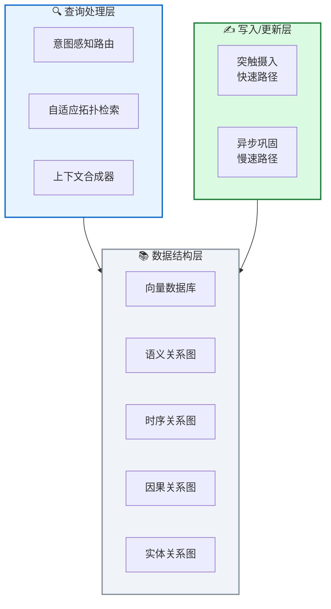

# 🧲 MAGMA: 多图智能体记忆架构

**A Multi-Graph based Agentic Memory Architecture for AI Agents**

---

## 📄 论文信息

| 项目 | 内容 |
|------|------|
| **arXiv** | 2601.03236 |
| **日期** | 2026 年 1 月 |
| **机构** | 德克萨斯大学达拉斯分校 |
| **基准** | LoCoMo / LongMemEval |
| **评分** | ⭐⭐⭐⭐⭐ 4.7/5.0 |

---

## 🔗 本体论映射

基于 Agent Memory 领域本体模型的 7 维度标注：

| 维度 | 标注 |
|------|------|
| **📦 记忆类型** | 语义式 + 情景式 |
| **🏗️ 记忆结构** | 多图式 (4 个正交图) |
| **⚙️ 记忆操作** | 编码 + 检索 + 更新 |
| **💾 记忆载体** | 图数据库 + 向量库 |
| **🎯 功能类型** | 推理 + 规划 |
| **🔁 使用模式** | 策略引导遍历 |
| **✅ 验证公理** | 效率 + 可解释性 |

---

## 🎯 核心主张

### 🤔 问题是什么？

现有记忆增强生成 (MAG) 系统依赖单一记忆存储和语义相似度检索，纠缠时序/因果/实体信息，限制可解释性和查询意图对齐，导致推理准确性次优。

### 💡 解决方案是什么？

MAGMA 提出多图智能体记忆架构，将每个记忆项表示为四个正交关系图 (语义/时序/因果/实体)，检索公式化为策略引导的图遍历，支持查询自适应选择和结构化上下文构建。

### 🌟 核心优势是什么？

1. 解耦记忆表示与检索逻辑
2. 透明推理路径和细粒度控制
3. LoCoMo Judge 分数 0.700 (+18.6% vs 次优)
4. 查询延迟 1.47s (比 A-MEM 快 40%)

---

## 💡 关键洞见

> 通过显式建模异质关系结构 (语义/时序/因果/实体)，MAGMA 实现了解耦的记忆表示，使检索从被动语义匹配转变为主动意图感知导航，显著提升长程推理准确性。

---

## 📐 方法架构

MAGMA 三层架构：查询处理层、数据结构层、写入/更新层。

### 🔍 查询处理层

- **意图感知路由**: 根据查询类型分发任务
- **自适应拓扑检索**: 执行图遍历
- **上下文合成器**: 生成最终响应

### 📚 数据结构层

- **向量数据库**: 语义搜索
- **4 个关系图**: 语义/时序/因果/实体
- **跨视图推理**: 提供拓扑基础

### ✍️ 写入/更新层

- **突触摄入 (快速路径)**: 延迟敏感
- **异步巩固 (慢速路径)**: 计算密集
- **平衡**: 响应速度与关系深度

---

## 📈 实验结果

### LoCoMo 主结果 (LLM-as-Judge)

| 方法 | Judge 分数 | 相对提升 |
|------|-----------|---------|
| Full Context | 0.481 | - |
| A-MEM | 0.58 | +20.6% |
| MemoryOS | 0.553 | +14.9% |
| Nemori | 0.59 | +22.7% |
| **MAGMA** | **0.700** | **+45.5%** |

**关键发现**: MAGMA 在 LoCoMo 上达到最高 Judge 分数 0.700，超越最强基线 Nemori (0.59) 18.6%，超越 Full Context 45.5%。在时序推理上表现尤为突出 (0.650 vs 0.422-0.649)。

### LongMemEval 泛化性

| 方法 | 平均准确率 | Token 消耗 |
|------|-----------|-----------|
| Full Context | 55.0% | 100k+ |
| Nemori | 56.2% | - |
| **MAGMA** | **61.2%** | **0.7k-4.2k** |

在 LongMemEval 上，MAGMA 达到 61.2% 平均准确率，超越 Full Context 6.2%，同时 token 消耗减少 95% 以上。

---

## ✅ 验证的领域公理

### 效率公理
查询延迟 1.47s (比 A-MEM 快 40%)，token 消耗 3.37k，证明自适应遍历策略的高效性。

### 可解释性公理
多图架构提供透明推理路径，支持细粒度检索控制，相比单一语义检索更具可解释性。

---

## ⚠️ 局限性

1. **依赖 LLM 推理保真度**: 记忆图质量依赖异步巩固中 LLM 的推理能力，可能受提取错误和幻觉影响
2. **存储和工程复杂度**: 多图基座相比扁平向量系统引入额外存储和工程复杂度
3. **评估范围有限**: 主要在 LoCoMo 和 LongMemEval 上评估，未覆盖多模态智能体或异构观察流等场景

---

## 🔮 未来工作方向

1. 探索更鲁棒的图构建方法，减少对 LLM 推理的依赖
2. 优化多图存储效率，降低工程复杂度
3. 扩展到多模态智能体和异构观察流场景
4. 研究图压缩技术，降低存储和检索开销

---

## 🏷️ 关键词

- 多图架构 (Multi-Graph Architecture)
- 关系解耦 (Relational Disentanglement)
- 意图感知检索 (Intent-Aware Retrieval)
- 自适应遍历 (Adaptive Traversal)
- 双流演化 (Dual-Stream Evolution)
- 长程推理 (Long-Horizon Reasoning)
- 可解释检索 (Interpretable Retrieval)
- 结构化上下文 (Structured Context)

---

## 📚 专业名词解释

### 📚 多图架构 (Multi-Graph)

将每个记忆项表示为四个正交关系图：语义图、时序图、因果图、实体图。解耦记忆表示与检索逻辑，支持类型对齐的上下文构建。

### 📚 自适应遍历策略 (Adaptive Traversal)

根据查询意图动态选择关系视图，剪枝无关图区域，实现低延迟和低 token 消耗的结构化检索。

### 📚 双流记忆演化 (Dual-Stream Evolution)

解耦延迟敏感的快速摄入 (突触摄入) 与计算密集的结构整合 (异步巩固)，平衡响应速度与关系深度。

---

## 🔗 链接

- **arXiv**: https://arxiv.org/abs/2601.03236
- **HTML 总结**: site/papers/2026/02_2026-01_MAGMA-多图智能体记忆架构_2026-03-19.html

---

**📅 总结日期**: 2026-03-19  
**📊 本体模型版本**: v1.2
