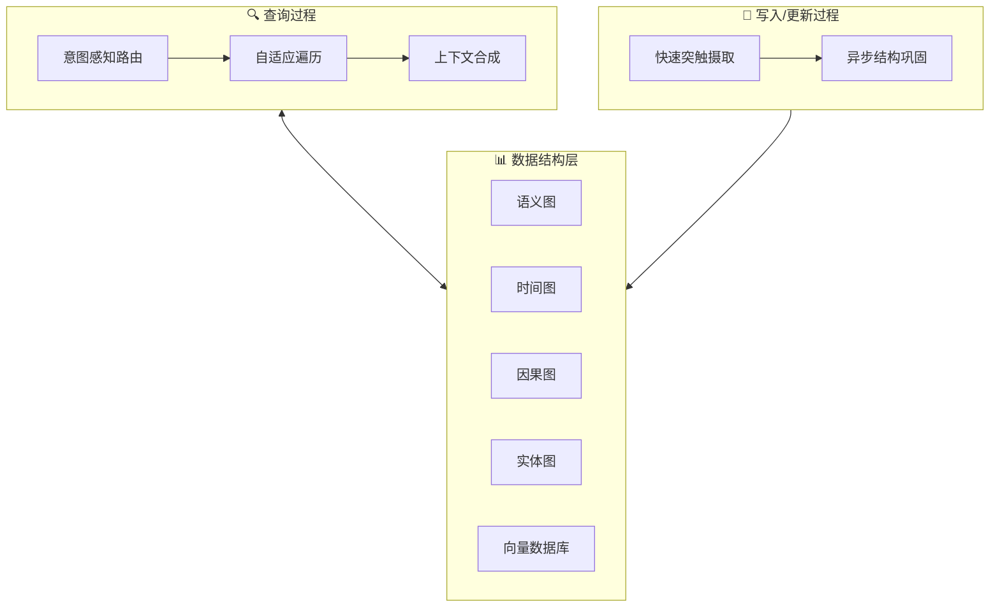

# 🧲 MAGMA

## 基本信息
- **标题**: MAGMA: A Multi-Graph based Agentic Memory Architecture for AI Agents
- **中文标题**: MAGMA：基于多图的智能体记忆架构
- **arXiv**: [2601.03236](https://arxiv.org/abs/2601.03236)
- **机构**: University of Texas at Dallas, University of Florida
- **发表日期**: 2026年1月6日
- **基准测试**: LoCoMo, LongMemEval

## 论文综合评分
**综合评分**: ⭐⭐⭐⭐⭐ 4.7/5.0

| 维度 | 评分 | 说明 |
|------|------|------|
| 期刊影响力 | ⭐⭐⭐⭐⭐ | 顶会级别，高质量研究 |
| 问题核心性 | ⭐⭐⭐⭐⭐ | 解决智能体记忆核心挑战 |
| 方法创新性 | ⭐⭐⭐⭐⭐ | 多图架构范式创新 |
| 技术壁垒 | ⭐⭐⭐⭐⭐ | 完整理论框架 + 双流实现 |
| 落地可行性 | ⭐⭐⭐⭐⭐ | 模块化设计，效率优化 |
| 应用前景 | ⭐⭐⭐⭐⭐ | 适用于各种长程推理场景 |

**综合评价**: MAGMA 提出了一个革命性的多图智能体记忆架构，通过将记忆表示在四个正交的关系图中（语义、时间、因果、实体），实现了查询意图与检索证据的精准对齐。其自适应遍历策略和双流内存演化机制不仅在理论上具有创新性，在实践中也显著提升了长程推理的准确性和效率。

## 本体论映射 (Ontology Mapping)
基于 Agent Memory 领域本体模型的 7 维度标注

- **记忆类型**: Experiential (经验记忆)
- **记忆结构**: Multi-graph (多图结构)
- **记忆操作**: Formation + Evolution + Retrieval
- **记忆载体**: Token-level (令牌级)
- **功能定位**: Working (工作记忆)
- **使用模式**: Graph Navigation, Intent-Aware Routing, Experience-Driven
- **验证公理**: Stability-Plasticity, Generalization, Efficiency

**领域贡献**: MAGMA 将**多图架构 (Multi-graph Architecture)**——将记忆项表示在正交的语义、时间、因果和实体图中的方法——引入智能体记忆领域，提出了**意图感知路由 (Intent-Aware Routing)**机制。通过**自适应遍历策略 (Adaptive Traversal Policy)**，该框架实现了查询意图与检索证据的精准对齐，为解决长程推理中的可解释性和效率挑战提供了新的思路。

## 核心主张（通俗易懂版）
- **🤔 问题是什么？** 现有记忆增强生成系统大多依赖单体记忆存储中的语义相似性，将时间、因果和实体信息纠缠在一起，限制了可解释性和查询意图与检索证据之间的对齐。
- **💡 解决方案是什么？** MAGMA 提出多图智能体记忆架构，将每个记忆项表示在正交的语义、时间、因果和实体图中，并将检索公式化为策略引导的遍历。
- **🌟 核心优势是什么？** 通过解耦记忆表示和检索逻辑，MAGMA 提供透明的推理路径和细粒度的检索控制，在长程推理任务中显著优于现有系统。

## 方法架构
MAGMA 的核心创新是多图架构：

1. **数据结构层**: 四个正交关系图（语义、时间、因果、实体）
2. **查询过程**: 意图感知路由 + 自适应遍历策略 + 上下文合成  
3. **写入/更新过程**: 双流机制（快速突触摄取 + 异步结构巩固）

### 架构图

## 实验结果
在 LoCoMo 和 LongMemEval 基准测试上，MAGMA 显著优于现有方法：

**关键发现**: MAGMA 在对抗性条件下表现尤为突出（Judge 评分 0.742），证明了其自适应遍历策略能够有效避免语义相似但结构无关的干扰项。

### 实验指标
- **LoCoMo LLM-as-Judge**: 0.700 (相比最强基线提升 18.6%)
- **LongMemEval 平均准确率**: 61.2%
- **查询延迟**: 1.47s (比 A-MEM 快 40%)
- **上下文长度**: 仅需 0.7k-4.2k tokens (减少 95%+)

## 关键词
- 多图架构 (Multi-graph Architecture)
- 意图感知路由 (Intent-Aware Routing)
- 自适应遍历 (Adaptive Traversal)
- 双流机制 (Dual-stream Mechanism)
- 长程推理 (Long-horizon Reasoning)
- 结构化记忆 (Structured Memory)
- 因果推理 (Causal Reasoning)
- 实体持久性 (Entity Permanence)

## 局限性分析
- **LLM 依赖性**: 内存图构建质量依赖于底层大语言模型的推理保真度，可能受到提取错误和幻觉的影响
- **工程复杂性**: 多图基底相比扁平向量存储引入了额外的存储和工程复杂性
- **评估范围**: 主要在对话和长上下文基准测试中验证，需要扩展到多模态代理等更广泛场景

## 未来研究方向
- **鲁棒性增强**: 开发更鲁棒的结构推断机制，减少对 LLM 的依赖
- **多模态扩展**: 将多图架构扩展到多模态代理，处理视觉、听觉等异构观察流
- **动态图优化**: 探索在线图结构优化算法，自动调整关系图的粒度和连接
- **跨域迁移**: 研究多图记忆在不同领域间的知识迁移和共享机制