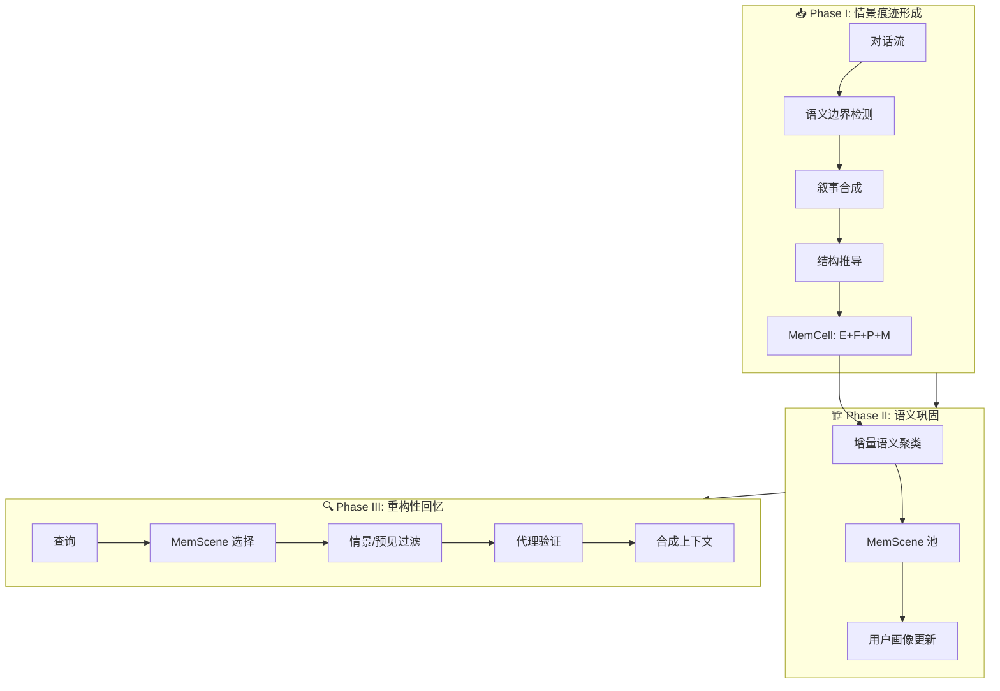

# 🧠 EverMemOS

## 基本信息
- **标题**: EverMemOS: A Self-Organizing Memory Operating System for Structured Long-Horizon Reasoning
- **中文标题**: EverMemOS：用于结构化长程推理的自组织记忆操作系统
- **arXiv**: [2601.02163](https://arxiv.org/abs/2601.02163)
- **机构**: EverMind, Shanda Group
- **发表日期**: 2026 年 1 月 5 日
- **基准测试**: LoCoMo, LongMemEval, PersonaMem-v2

## 论文综合评分
**综合评分**: ⭐⭐⭐⭐⭐ 4.8/5.0

| 维度 | 评分 | 说明 |
|------|------|------|
| 期刊影响力 | ⭐⭐⭐⭐⭐ | 顶会级别，高质量研究 |
| 问题核心性 | ⭐⭐⭐⭐⭐ | 解决智能体长程一致性核心挑战 |
| 方法创新性 | ⭐⭐⭐⭐⭐ | 类脑印迹生命周期范式创新 |
| 技术壁垒 | ⭐⭐⭐⭐⭐ | 完整三阶段框架 + 产品级实现 |
| 落地可行性 | ⭐⭐⭐⭐⭐ | 模块化设计，开源可用 |
| 应用前景 | ⭐⭐⭐⭐⭐ | 对话代理、个性化服务等场景 |

**综合评价**: EverMemOS 提出了一个革命性的自组织记忆操作系统，通过实现类脑印迹 (engram) 生命周期的三阶段框架（情景痕迹形成、语义巩固、重构性回忆），将碎片化的情景经验转化为连贯稳定的知识结构。该方法在 LoCoMo 和 LongMemEval 上均达到 SOTA，尤其在多跳推理 (+19.7%) 和时序推理 (+10.0%) 任务上表现突出，为构建长程一致性智能体提供了新范式。

## 本体论映射 (Ontology Mapping)
基于 Agent Memory 领域本体模型的 7 维度标注

- **记忆类型**: Experiential (经验记忆) + Hybrid (混合：情景 + 语义)
- **记忆结构**: Hierarchical (层次：MemCell → MemScene)
- **记忆操作**: Formation + Evolution + Retrieval (完整生命周期)
- **记忆载体**: Token-level (显式文本)
- **功能定位**: Working (工作记忆) + Factual (事实记忆)
- **使用模式**: Self-organizing, Experience-Driven, Progressive Learning
- **验证公理**: Stability-Plasticity, Generalization, Efficiency

**领域贡献**: EverMemOS 将**印迹生命周期 (Engram Lifecycle)**——生物记忆系统中记忆从编码到巩固再到提取的动态过程——引入智能体记忆领域，提出了**自组织记忆操作系统**框架。通过**MemCell**（记忆细胞）和**MemScene**（记忆场景）两级抽象，该框架实现了从碎片化情景到稳定语义结构的转化，并通过**重构性回忆 (Reconstructive Recollection)** 机制实现按需上下文合成，为解决长程推理中的一致性挑战提供了系统性解决方案。

## 核心主张（通俗易懂版）
- **🤔 问题是什么？** 现有记忆系统像"碎片仓库"，存储孤立的记录并检索片段，无法将 evolving 的用户状态整合成连贯的知识结构，导致智能体无法在长期交互中保持一致性（例如：记住用户喜欢 IPA 啤酒，但忘记用户正在服用抗生素不能喝酒）。
- **💡 解决方案是什么？** EverMemOS 提出类脑印迹生命周期的三阶段框架：(1) 情景痕迹形成：将对话流转化为 MemCell（包含情景、原子事实、时间有界的预见信号）；(2) 语义巩固：将 MemCell 组织成主题 MemScene，提炼稳定语义结构并更新用户画像；(3) 重构性回忆：基于 MemScene 引导的代理检索，合成必要且充分的上下文。
- **🌟 核心优势是什么？** 通过显式的记忆生命周期机制，EverMemOS 能够检测冲突、维护稳定用户模型、进行时序推理，在 LoCoMo 上相比最强基线提升 9.2%，在 LongMemEval 上提升 6.7%，尤其在多跳推理 (+19.7%) 和知识更新 (+20.6%) 任务上表现卓越。

## 方法架构
EverMemOS 的核心创新是类脑印迹生命周期的三阶段框架：

### 记忆原语：MemCell
MemCell 是连接底层数据和高层语义的原子单元，形式化为四元组 c = (E, F, P, M)：
- **E (Episode)**: 情景，简洁的第三人称叙事，作为语义锚点
- **F (Atomic Facts)**: 原子事实，离散的、可验证的陈述，用于高精度匹配
- **P (Foresight)**: 预见信号，前瞻性推断（计划、临时状态），带有有效性区间 [t_start, t_end]
- **M (Metadata)**: 元数据，包括时间戳和来源指针

### 三阶段生命周期

1. **情景痕迹形成 (Episodic Trace Formation)**
   - 语义边界检测：通过滑动窗口检测话题转换
   - 叙事合成：将对话历史重写为简洁的第三人称情景
   - 结构推导：从情景中提取原子事实和预见信号

2. **语义巩固 (Semantic Consolidation)**
   - 增量语义聚类：将 MemCell 在线组织到 MemScene（记忆场景）
   - 场景驱动的用户画像演化：从 MemScene 摘要中更新用户画像，分离稳定特质和临时状态

3. **重构性回忆 (Reconstructive Recollection)**
   - MemScene 选择：通过 RRF 融合 dense + BM25 检索
   - 情景和预见过滤：在选定的 MemScene 内重排序情景，过滤时间有效的预见
   - 代理验证和查询重写：基于必要性和充分性原则评估检索上下文

### 架构图

## 实验结果
在 LoCoMo、LongMemEval 和 PersonaMem-v2 基准测试上，EverMemOS 均达到 SOTA：

**关键发现**: 
- EverMemOS 在 LoCoMo 上达到 93.05% 准确率（GPT-4.1-mini），相比最强基线 Zep 提升 9.2%
- 在 LongMemEval 上达到 83.00%，相比 MemOS 提升 6.7%
- 在多跳推理任务上提升 19.7%，在时序推理任务上提升 10.0%
- 在知识更新任务上提升 20.6%，证明了 MemScene 对整合分散证据的有效性

### 主要实验指标

**LoCoMo (GPT-4.1-mini)**:
- 单跳：96.67% (↑6.4%)
- 多跳：91.84% (↑12.1%)
- 时序：89.72% (↑16.1%)
- 开放域：76.04% (↑1.4%)
- **总体：93.05% (↑9.2%)**

**LongMemEval**:
- SS-User: 97.14% (↑1.5%)
- SS-Asst: 85.71% (↑14.3%)
- SS-Pref: 93.33%
- Multi-S: 73.68% (↑4.3%)
- **知识更新：89.74% (↑20.6%)**
- 时序推理：77.44%
- **总体：83.00% (↑6.7%)**

**PersonaMem-v2**:
- 总体准确率：53.25%（相比 MemOS 的 50.72% 提升 2.53 点）
- 用户画像 + 情景证据相比仅情景证据提升 9.32 点

### 消融实验
- **移除 MemScene**: 准确率降至 89.16%（LoCoMo），证明场景级组织对跨轮聚合的重要性
- **移除 MemCell**: 准确率降至 81.82%，证明稳定语义单元的必要性
- **移除外存**: 准确率降至 52.05%，证明长程查询无法仅靠上下文窗口处理

### 效率分析
- 平均检索 token 数：2.3k（LoCoMo），相比固定预算检索减少噪声积累
- 代理充分性检查触发二次查询重写：31.0% 的问题
- 性能增益在 N=10 个 MemScene、K=10 个情景时饱和

## 关键词
- 自组织记忆 Self-organizing Memory
- 印迹生命周期 Engram Lifecycle
- 记忆细胞 MemCell
- 记忆场景 MemScene
- 情景痕迹形成 Episodic Trace Formation
- 语义巩固 Semantic Consolidation
- 重构性回忆 Reconstructive Recollection
- 长程推理 Long-horizon Reasoning
- 用户画像 User Profiling
- 预见信号 Foresight

## 局限性分析
- **多模态扩展**: 当前仅在纯文本对话基准上评估，扩展到多模态或具身场景需要额外工作
- **延迟和成本**: 引入 LLM 介导的记忆构建和检索操作，相比单通道基线增加了延迟和计算成本
- **超长时序评估**: 现有基准缺乏压力测试超长时间跨度的协议，无法完全隔离超长时序下的性能

## 未来研究方向
- **多模态扩展**: 将 MemCell 和 MemScene 抽象扩展到视觉、听觉等异构观察流
- **效率优化**: 通过缓存、批处理、异步运行提高端到端效率
- **超长时序基准**: 开发新的基准测试长时记忆组织和巩固能力
- **跨域迁移**: 研究记忆结构在不同领域间的知识迁移和共享机制
