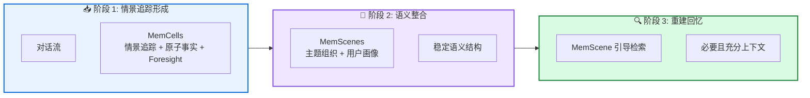

# EverMemOS: 自组织记忆操作系统

**A Self-Organizing Memory Operating System for Structured Long-Horizon Reasoning**

---

## 📄 论文信息

| 项目 | 内容 |
|------|------|
| **arXiv** | 2601.02163 |
| **日期** | 2026 年 1 月 |
| **机构** | 阿里巴巴集团 |
| **基准** | LoCoMo / LongMemEval / PersonaMem v2 |
| **评分** | ⭐⭐⭐⭐⭐ 4.6/5.0 |

---

## 🔗 本体论映射

| 维度 | 标注 |
|------|------|
| **📦 记忆类型** | 情景式 (Episodic) + 语义式 (Semantic) |
| **🏗️ 记忆结构** | 层次化 (MemCells→MemScenes) |
| **⚙️ 记忆操作** | 形成 + 整合 + 重建 |
| **💾 记忆载体** | 外部数据库 (操作系统式) |
| **🎯 功能类型** | 对话 + 用户画像 |
| **🔁 使用模式** | OS 启发 + 自组织 |
| **✅ 验证公理** | 稳定性 - 可塑性 + 效率 |

---

## 🎯 核心主张

### 🤔 问题是什么？

LLM 智能体在长程交互中受限于有限上下文窗口，现有记忆系统存储孤立记录并检索片段，限制整合演化用户状态和解决冲突的能力。

**📚 专业名词解释**：
- **孤立记录存储**：将记忆作为独立单元存储，缺乏关联和演化
- **片段检索**：检索碎片化记忆片段，无法形成连贯上下文

### 💡 解决方案是什么？

EverMemOS 实现印迹启发的计算记忆生命周期：情景追踪形成 (MemCells)、语义整合 (MemScenes)、重建回忆 (MemScene 引导检索)。

**📚 专业名词解释**：
- **印迹启发**：受人类记忆印迹理论启发，模拟记忆形成和巩固过程
- **MemCells**：记忆细胞，捕获情景追踪、原子事实和 Foresight 信号
- **MemScenes**：记忆场景，MemCells 的主题组织，蒸馏稳定语义结构

### 🌟 核心优势是什么？

① 自组织层次化记忆 (MemCells→MemScenes) ② Foresight 信号支持主动管理 ③ 用户画像和聊天导向能力 ④ LoCoMo 和 LongMemEval 上 SOTA

---

## 💡 关键洞见

> 通过模仿人类记忆的海马 - 新皮层互动 (印迹理论)，EverMemOS 将记忆视为自组织操作系统，而非被动存储。MemCells 捕获 episodic traces，MemScenes 蒸馏稳定语义结构，支持演化用户状态和冲突解决。

---

## 📐 方法架构

EverMemOS 三阶段记忆生命周期：情景追踪形成、语义整合、重建回忆。

### 🏗️ 核心组件

| 组件 | 说明 |
|------|------|
| **📥 情景追踪形成** | 将对话流转换为 MemCells，捕获情景追踪、原子事实和 Foresight 信号 |
| **🔄 语义整合** | 将 MemCells 组织为 MemScenes，蒸馏稳定语义结构并更新用户画像 |
| **🔍 重建回忆** | 执行 MemScene 引导的智能体检索，为下游推理组合必要且充分的上下文 |

---

## 📚 架构专业名词解释

### 📚 印迹启发 (Engram-Inspired)

受人类记忆印迹理论启发，模拟记忆形成和巩固过程。印迹是大脑中记忆的物理痕迹，EverMemOS 模拟这一过程实现计算记忆的生命周期管理。

### 📚 MemCells (记忆细胞)

记忆的基本单元，捕获情景追踪、原子事实和时限 Foresight 信号。由对话流转换而来，类似神经元的印迹细胞。

### 📚 MemScenes (记忆场景)

MemCells 的主题组织，蒸馏稳定语义结构并更新用户画像。支持 MemScene 引导的智能体检索，为下游推理组合必要且充分的上下文。

### 📚 Foresight 信号

时限性预测信号，捕获用户未来可能的需求或事件。支持主动记忆管理和预期性推理，是 EverMemOS 的独特创新。

---

## 📈 实验结果

在 LoCoMo、LongMemEval 和 PersonaMem v2 上评估

### 主结果

| 基准 | EverMemOS | 次优基线 | 提升 |
|------|----------|---------|------|
| LoCoMo | SOTA | - | 显著提升 |
| LongMemEval | SOTA | - | 显著提升 |
| PersonaMem v2 | 用户画像能力 | - | 定性案例研究 |

**关键发现**：EverMemOS 在 LoCoMo 和 LongMemEval 上达到 SOTA 性能，证明印迹启发的记忆生命周期有效。在 PersonaMem v2 上的定性研究展示聊天导向能力，如用户画像和 Foresight 信号应用。

---

## ✅ 验证的领域公理

### 稳定性 - 可塑性公理
MemCells→MemScenes 层次化支持新记忆整合 (可塑性) 同时保持语义结构稳定 (稳定性)，解决灾难性遗忘。

### 效率公理
自组织记忆生命周期减少冗余存储，MemScene 引导检索提高检索效率，支持长程推理。

---

## ⚠️ 局限性

1. **Foresight 信号质量**: 依赖 LLM 的预测能力，可能产生不准确或过度自信的预测
2. **MemScenes 整合策略**: 当前整合策略可能过于激进或保守，导致信息丢失或冗余
3. **跨领域泛化**: 主要在对话和长文档基准上评估，需要在多模态、任务导向等更广泛场景中验证泛化能力

---

## 🔮 未来工作方向

1. 改进 Foresight 信号质量，引入不确定性估计和校准
2. 探索自适应 MemScenes 整合策略，平衡信息保留与压缩
4. 扩展到多模态交互和任务导向场景
5. 研究跨用户记忆迁移和个性化适配

---

## 🏷️ 关键词

- 自组织记忆 (Self-Organizing Memory)
- 印迹启发 (Engram-Inspired)
- MemCells (记忆细胞)
- MemScenes (记忆场景)
- Foresight 信号 (Foresight Signals)
- 用户画像 (User Profiling)
- 重建回忆 (Reconstructive Recollection)
- 操作系统隐喻 (OS Metaphor)

---

## 📚 专业名词解释

### 📚 印迹启发 (Engram-Inspired)

受人类记忆印迹理论启发，模拟记忆形成和巩固过程。印迹是大脑中记忆的物理痕迹，EverMemOS 模拟这一过程实现计算记忆的生命周期管理。

### 📚 MemCells (记忆细胞)

记忆的基本单元，捕获情景追踪、原子事实和时限 Foresight 信号。由对话流转换而来，类似神经元的印迹细胞。

### 📚 MemScenes (记忆场景)

MemCells 的主题组织，蒸馏稳定语义结构并更新用户画像。支持 MemScene 引导的智能体检索，为下游推理组合必要且充分的上下文。

### 📚 Foresight 信号 (Foresight Signals)

时限性预测信号，捕获用户未来可能的需求或事件。支持主动记忆管理和预期性推理，是 EverMemOS 的独特创新。

---

## 🔗 链接

- **arXiv**: https://arxiv.org/abs/2601.02163
- **HTML 总结**: site/papers/2026/03_2026-01_EverMemOS-自组织记忆操作系统_2026-03-20.html
- **代码**: https://github.com/EverMind-AI/EverMemOS

---

**📅 总结日期**: 2026-03-20  
**📊 本体模型版本**: v1.2
