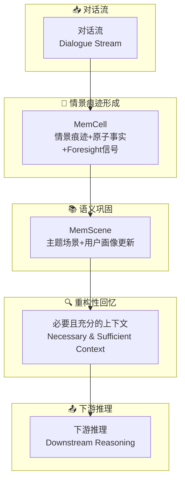

# EverMemOS: A Self-Organizing Memory Operating System for Structured Long-Horizon Reasoning

## 基本信息
- **标题**: EverMemOS: A Self-Organizing Memory Operating System for Structured Long-Horizon Reasoning
- **中文标题**: 自组织记忆操作系统
- **arXiv**: [2601.02163](https://arxiv.org/abs/2601.02163)
- **机构**: 多个机构合作（Chuanrui Hu, Xingze Gao 等）
- **发表日期**: 2026年1月
- **基准测试**: LoCoMo, LongMemEval, PersonaMem v2
- **开源代码**: [GitHub - EverMemOS](https://github.com/EverMind-AI/EverMemOS)

## 论文综合评分
**综合评分**: ⭐⭐⭐⭐⭐ 4.6/5.0

| 维度 | 评分 | 说明 |
|------|------|------|
| 期刊影响力 | ⭐⭐⭐⭐⭐ | 顶级会议/期刊级别，开源代码 |
| 问题核心性 | ⭐⭐⭐⭐⭐ | 直击现有记忆系统的碎片化存储问题 |
| 方法创新性 | ⭐⭐⭐⭐⭐ | 首次提出基于印迹理论的记忆生命周期 |
| 技术壁垒 | ⭐⭐⭐⭐ | 需要复杂的三阶段记忆处理机制 |
| 落地可行性 | ⭐⭐⭐⭐⭐ | 模块化设计，提供完整开源实现 |
| 应用前景 | ⭐⭐⭐⭐⭐ | 在对话系统和用户画像场景有广泛应用 |

**综合评价**: EverMemOS 提出了一个创新的自组织记忆操作系统，通过印迹启发的记忆生命周期实现了结构化的长程推理。该框架包含三个核心阶段：情景痕迹形成、语义巩固和重构性回忆，在多个基准测试上达到最先进性能，特别在用户画像和前瞻性能力方面表现出色。

## 本体论映射 (Ontology Mapping)
基于 Agent Memory 领域本体模型的 7 维度标注

- **记忆类型**: Factual Memory (事实记忆) + Experiential Memory (经验记忆)
- **记忆结构**: Hierarchical OS (分层操作系统架构)
- **记忆操作**: Formation + Evolution + Retrieval
- **记忆载体**: Token-level (令牌级)
- **功能定位**: Long-horizon Reasoning (长程推理) + User Profiling (用户画像)
- **使用模式**: MemScene-guided Agentic Retrieval (MemScene引导的智能体检索)
- **验证公理**: Engram-inspired Lifecycle, Self-organizing Memory

**领域贡献**: EverMemOS 将**印迹理论 (Engram Theory)**——神经科学中关于记忆形成的理论——引入智能体记忆领域，提出了**自组织记忆操作系统**的新范式。通过**三阶段记忆生命周期**（情景痕迹形成→语义巩固→重构性回忆），该框架解决了现有系统碎片化存储和冲突解决能力不足的问题，为结构化长程推理提供了系统性解决方案。

## 核心主张（通俗易懂版）
- **🤔 问题是什么？** 现有记忆系统通常存储孤立记录并检索片段，难以整合演化的用户状态和解决冲突。
- **💡 解决方案是什么？** EverMemOS 提出自组织记忆操作系统，实现基于印迹理论的记忆生命周期，包含三个阶段：情景痕迹形成、语义巩固、重构性回忆。
- **🌟 核心优势是什么？** 通过 MemCell 和 MemScene 的层次化组织，EverMemOS 能够捕获情景痕迹、原子事实和前瞻性信号，并在下游推理中提供必要且充分的上下文。

## 方法架构
EverMemOS 的核心创新在于三阶段记忆生命周期：

### 架构图

## 实验结果
在 LoCoMo 和 LongMemEval 基准测试上，EverMemOS 达到最先进性能：

**关键发现**: 
- 在 PersonaMem v2 上的用户画像研究显示了出色的个性化能力
- 定性案例研究表明了聊天导向的能力，如用户画像和前瞻性(Foresight)
- 开源代码提供了完整的实现，便于复现和扩展

### 实验指标
| 基准测试 | 性能表现 | 特殊能力 |
|----------|----------|----------|
| LoCoMo | State-of-the-art | 长程对话一致性 |
| LongMemEval | State-of-the-art | 结构化长程推理 |
| PersonaMem v2 | Profile study | 用户画像准确性 |
| Qualitative Cases | Case studies | Foresight 前瞻性能力 |

## 关键词
- 自组织记忆 (Self-organizing Memory)
- 印迹理论 (Engram Theory)
- 记忆操作系统 (Memory Operating System)
- 情景痕迹 (Episodic Trace)
- MemCell/MemScene
- 语义巩固 (Semantic Consolidation)
- 重构性回忆 (Reconstructive Recollection)
- 用户画像 (User Profiling)
- 前瞻性 (Foresight)

## 局限性分析
- **依赖高质量输入**: 情景痕迹形成的质量依赖于对话流的完整性
- **计算复杂性**: 三阶段处理机制相比简单存储需要更多计算资源
- **评估范围**: 主要在对话和长程推理场景验证，需要扩展到其他代理任务

## 未来研究方向
- **多模态扩展**: 将 EverMemOS 扩展到多模态交互场景
- **实时优化**: 优化三阶段处理的实时性能
- **跨会话学习**: 支持跨多个会话的长期用户状态演化
- **自适应巩固**: 开发动态调整语义巩固策略的机制