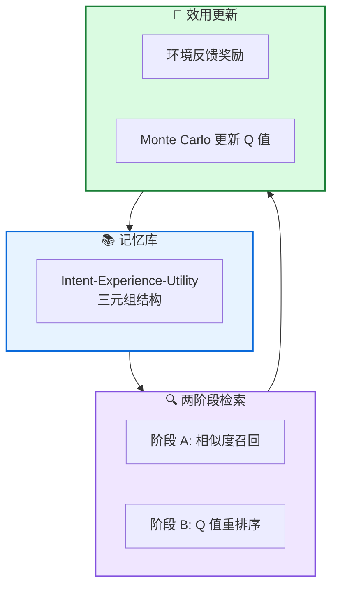

# 🧠 MemRL: 运行时强化学习自进化智能体

**Self-Evolving Agents via Runtime Reinforcement Learning on Episodic Memory**

---

## 📄 论文信息

| 项目 | 内容 |
|------|------|
| **arXiv** | 2601.03192 |
| **日期** | 2026 年 1 月 |
| **机构** | 上海交通大学等 |
| **基准** | HLE / BigCodeBench / ALFWorld / Lifelong Agent Bench |
| **评分** | ⭐⭐⭐⭐⭐ 4.7/5.0 |

---

## 🔗 本体论映射

| 维度 | 标注 |
|------|------|
| **📦 记忆类型** | 经验式 (Experiential) |
| **🏗️ 记忆结构** | 层次化 (Hierarchical) |
| **⚙️ 记忆操作** | 检索 + 更新 |
| **💾 记忆载体** | 外部数据库 |
| **🎯 功能类型** | 学习 |
| **🔁 使用模式** | 自进化 + 强化学习 |
| **✅ 验证公理** | 稳定性 - 可塑性 + 效率 |

---

## 🎯 核心主张

### 🤔 问题
当前 AI 智能体难以模拟人类自进化能力：微调计算成本高且易灾难性遗忘，现有记忆方法依赖被动语义匹配，无法区分高价值策略和噪声。

### 💡 方案
MemRL 提出非参数化方法，通过在情景记忆上运行时强化学习实现自进化。采用 Intent-Experience-Utility triplet 结构和两阶段检索，基于环境反馈学习 Q 值区分高价值记忆。

### 🌟 优势
①无需权重更新避免灾难性遗忘 ②Q 值驱动检索超越语义匹配 ③4 个基准 CSR +3.8% vs 次优 ④理论保证单调改进无漂移

---

## 💡 关键洞见

> 通过将检索公式化为基于价值的决策过程，MemRL 使智能体能够从交互反馈中学习稳健的效用估计 (Q 值)，区分高价值经验和语义相似噪声，实现无需权重更新的持续运行时改进。

---

## 📐 方法架构

MemRL 包含三元组记忆库、两阶段检索、运行时效用更新三大核心组件。

### 📚 三元组记忆库
- **Intent**: 标识查询意图
- **Experience**: 存储解决方案轨迹
- **Q-value**: 通过 Q 值表示预期回报

### 🔍 两阶段检索
- **阶段 A**: 基于相似度召回候选池 (k1=5)
- **阶段 B**: 使用 Q 值重排序选择最终上下文 (k2=3)

### 🔄 运行时效用更新
- **环境反馈**: 根据任务成功/失败更新 Q 值
- **Monte Carlo 规则**: Q_new ← Q_old + α(r - Q_old)

---

## 📈 实验结果

### Runtime Learning 结果

| 方法 | BigCodeBench | Lifelong | ALFWorld | HLE | 平均 CSR |
|------|-------------|----------|----------|-----|---------|
| No Memory | 0.485 | 0.674 | 0.860 | 0.777 | 0.631 |
| RAG | 0.475 | 0.690 | 0.914 | 0.887 | 0.699 |
| Mem0 | 0.487 | 0.670 | 0.920 | 0.894 | 0.712 |
| MemP | 0.578 | 0.736 | 0.960 | 0.885 | 0.760 |
| **MemRL** | **0.595** | **0.788** | **0.960** | **0.949** | **0.798** |

**关键发现**: MemRL 在所有领域超越最强基线 MemP，平均 CSR +3.8%。在探索密集型环境 (ALFWorld/OS) 提升最显著 (+6.2%)。

### Transfer Learning 结果

| 方法 | BigCodeBench | Lifelong | ALFWorld | 平均 SR |
|------|-------------|----------|----------|--------|
| No Memory | 0.485 | 0.673 | 0.841 | 0.709 |
| RAG | 0.479 | 0.713 | 0.920 | 0.765 |
| MemP | 0.494 | 0.720 | 0.928 | 0.766 |
| **MemRL** | **0.508** | **0.746** | **0.979** | **0.794** |

MemRL 展现卓越迁移能力，平均 SR +2.8% vs MemP，ALFWorld 上 +5.8%。

---

## ✅ 验证的领域公理

### 稳定性 - 可塑性公理
理论证明 Q 值更新无偏且方差有界，遗忘率 0.041 vs MemP 0.051，CSR 与 SR 同步增长无灾难性遗忘。

### 效率公理
非参数化学习无需权重更新，计算成本显著低于微调，支持持续运行时改进。

---

## ⚠️ 局限性

1. **高方差噪声**: 当前逐步更新虽快，但在长程轨迹中可能引入高方差噪声
2. **信用分配模糊**: 效用更新时多经验参考导致信用分配不明确
3. **任务相似性依赖**: 任务相似性低时性能可能退化为类 Reflexion 行为

---

## 🔮 未来工作方向

1. 探索多步更新和定期记忆巩固，减少长程轨迹噪声
2. 研究 Shapley 值等精确信用分配方法
3. 扩展跨模型记忆迁移和多任务模块化合并能力
4. 研究记忆安全和多智能体记忆共享机制

---

## 🏷️ 关键词

- 运行时强化学习 (Runtime RL)
- 自进化智能体 (Self-Evolving Agents)
- 情景记忆 (Episodic Memory)
- Q 值驱动检索 (Q-Value Retrieval)
- 非参数化学习 (Non-Parametric Learning)
- 稳定性 - 可塑性 (Stability-Plasticity)
- 两阶段检索 (Two-Phase Retrieval)
- 效用驱动更新 (Utility-Driven Update)

---

## 📚 专业名词解释

### 📚 Intent-Experience-Utility Triplet

记忆三元组结构：Intent(意图) 标识查询意图，Experience(经验) 存储解决方案轨迹，Utility(效用) 通过 Q 值表示预期回报，支持基于价值的检索决策。

### 📚 两阶段检索 (Two-Phase Retrieval)

两阶段检索机制：阶段 A 基于相似度召回候选池，阶段 B 使用 Q 值重排序选择最终上下文，平衡探索 (相似度) 和利用 (效用)。

### 📚 非参数化强化学习

无需更新模型权重的 RL 方法，通过在记忆空间优化检索策略 (Q 值更新)，实现智能体自进化，避免灾难性遗忘和高计算成本。

---

## 🔗 链接

- **arXiv**: https://arxiv.org/abs/2601.03192
- **HTML 总结**: site/papers/2026/04_2026-01_MemRL-运行时强化学习自进化智能体_2026-03-19.html

---

**📅 总结日期**: 2026-03-19  
**📊 本体模型版本**: v1.2
