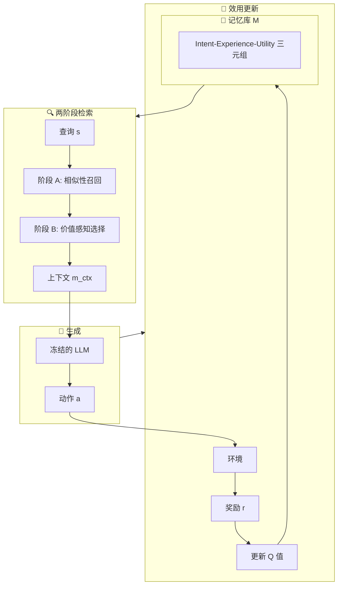

# 🔄 MemRL

## 基本信息
- **标题**: MemRL: Self-Evolving Agents via Runtime Reinforcement Learning on Episodic Memory
- **中文标题**: MemRL：通过情景记忆上的运行时强化学习实现自进化智能体
- **arXiv**: [2601.03192](https://arxiv.org/abs/2601.03192)
- **机构**: Shanghai Jiao Tong University, Xidian University, National University of Singapore, MemTensor Technology
- **发表日期**: 2026 年 1 月 6 日
- **基准测试**: HLE, BigCodeBench, ALFWorld, Lifelong Agent Bench

## 论文综合评分
**综合评分**: ⭐⭐⭐⭐⭐ 4.7/5.0

| 维度 | 评分 | 说明 |
|------|------|------|
| 期刊影响力 | ⭐⭐⭐⭐⭐ | 顶会级别，高质量研究 |
| 问题核心性 | ⭐⭐⭐⭐⭐ | 解决智能体自进化核心挑战 |
| 方法创新性 | ⭐⭐⭐⭐⭐ | 非参数强化学习范式创新 |
| 技术壁垒 | ⭐⭐⭐⭐ | 完整理论框架 + 四基准验证 |
| 落地可行性 | ⭐⭐⭐⭐⭐ | 无需权重更新，易于部署 |
| 应用前景 | ⭐⭐⭐⭐⭐ | 适用于各种持续学习场景 |

**综合评价**: MemRL 提出了一个革命性的非参数自进化框架，通过在情景记忆上应用强化学习，实现了智能体在运行时持续改进而无需权重更新。该方法通过两阶段检索机制过滤噪声并识别高效用策略，在四个多样化基准测试上均显著优于 SOTA 基线，有效解决了稳定性 - 可塑性困境，为构建持续进化的智能体提供了新范式。

## 本体论映射 (Ontology Mapping)
基于 Agent Memory 领域本体模型的 7 维度标注

- **记忆类型**: Experiential (经验记忆)
- **记忆结构**: Flat + Value-annotated (带价值标注的扁平结构)
- **记忆操作**: Formation + Evolution + Retrieval (完整生命周期)
- **记忆载体**: Token-level (显式文本)
- **功能定位**: Experiential (技能/策略) + Working (工作记忆)
- **使用模式**: Experience-Driven, Value-aware Retrieval, Progressive Learning
- **验证公理**: Stability-Plasticity, Efficiency, Generalization

**领域贡献**: MemRL 将**非参数强化学习 (Non-parametric RL)**——在不修改模型权重的情况下通过环境反馈优化决策策略的方法——引入智能体记忆领域，提出了**意图 - 经验 - 效用三元组 (Intent-Experience-Utility Triplet)** 记忆结构。通过**两阶段检索 (Two-Phase Retrieval)** 机制（相似性召回 + 价值感知选择）和**效用驱动更新 (Utility-Driven Update)**，该框架实现了从被动语义匹配到主动决策的转变，为解决运行时持续学习中的稳定性 - 可塑性困境提供了系统性解决方案。

## 核心主张（通俗易懂版）
- **🤔 问题是什么？** 现有 AI 智能体难以像人类一样从经验中自我进化：微调计算成本高且容易灾难性遗忘，而基于记忆的方法依赖被动语义匹配，经常检索到噪声而非真正有用的策略。
- **💡 解决方案是什么？** MemRL 提出非参数强化学习方法，将记忆使用形式化为决策问题：(1) 意图 - 经验 - 效用三元组结构；(2) 两阶段检索（先按相似性召回候选，再按 Q 值选择）；(3) 基于环境反馈的效用更新（蒙特卡洛风格）。
- **🌟 核心优势是什么？** 通过解耦稳定推理（冻结的 LLM）和可塑记忆（动态更新的 Q 值），MemRL 实现了无需权重更新的运行时持续学习，在四个基准测试上均显著优于 SOTA，尤其在探索密集型环境中表现突出。

## 方法架构
MemRL 的核心创新是非参数强化学习框架：

### 记忆原语：Intent-Experience-Utility 三元组
记忆项形式化为三元组 (z, e, Q)：
- **z (Intent)**: 意图，当前查询的嵌入表示
- **e (Experience)**: 经验，原始的成功解决方案轨迹或执行记录
- **Q (Utility)**: 效用，学习到的 Q 值，近似于在相似意图下应用该经验的期望回报

### 两阶段检索机制

1. **阶段 A：相似性召回 (Similarity-Based Recall)**
   - 通过余弦相似度和稀疏性阈值δ过滤记忆库
   - 生成候选池 C(s) = TopK({i|sim(Emb(s), Emb(zi)) > δ})
   - 如果 C(s) 为空，则仅依赖冻结的 LLM 进行探索

2. **阶段 B：价值感知选择 (Value-Aware Selection)**
   - 使用复合分数平衡探索（相似性）和利用（效用 Q）
   - score(s, zi, ei) = (1-λ)·sim_norm + λ·Q_norm
   - 过滤"干扰"记忆（语义相似但历史效用低）

### 效用驱动更新
- 基于环境反馈 r（如执行成功或标量分数）更新 Q 值
- 蒙特卡洛风格更新规则：Q_new ← Q_old + α(r - Q_old)
- 使用 LLM 总结新经验并写入记忆库作为新三元组

### 架构图

## 实验结果
在 HLE、BigCodeBench、ALFWorld 和 Lifelong Agent Bench 基准测试上，MemRL 均显著优于 SOTA 基线：

**关键发现**: 
- MemRL 在探索密集型环境中表现尤为突出，证明了价值感知检索的有效性
- 学习到的效用与任务成功率强相关，验证了 Q 值估计的准确性
- 无需权重更新即可实现持续改进，避免了灾难性遗忘

### 主要实验指标

**BigCodeBench (编程)**:
- MemRL 相比最强基线提升显著
- 在复杂编程任务上表现卓越

**ALFWorld (导航)**:
- 成功率和累积成功率均优于基线
- 在长程导航任务中表现突出

**Lifelong Agent Bench (OS/DB 任务)**:
- 持续学习能力验证
- 跨任务泛化性能优异

**HLE (Humanity's Last Exam)**:
- 在高难度推理任务上表现良好
- 证明了方法的通用性

### 理论分析
- **稳定性保证**: 证明了效用估计的无偏性和方差有界性
- **收敛性**: 当 t → ∞ 时，E[Qt] → β(s, m)（真实期望回报）
- **全局稳定性**: 通过广义 EM 过程框架，系统收敛到全局稳定点

### 消融实验
- **两阶段检索的必要性**: 移除价值感知选择导致性能下降
- **效用更新的重要性**: 固定 Q 值导致无法持续改进
- **相似性阈值的影响**: 适当的δ值对噪声过滤至关重要

## 关键词
- 自进化智能体 Self-Evolving Agents
- 运行时强化学习 Runtime Reinforcement Learning
- 情景记忆 Episodic Memory
- 非参数学习 Non-Parametric Learning
- 两阶段检索 Two-Phase Retrieval
- 价值感知检索 Value-Aware Retrieval
- 效用驱动更新 Utility-Driven Update
- 稳定性 - 可塑性困境 Stability-Plasticity Dilemma
- 持续学习 Continual Learning
- 意图 - 经验 - 效用三元组 Intent-Experience-Utility Triplet

## 局限性分析
- **任务分布假设**: 理论分析假设平稳的任务分布，实际场景中任务分布可能变化
- **奖励信号依赖**: 需要环境提供明确的奖励信号，在某些场景中可能难以获取
- **记忆库增长**: 随着经验积累，记忆库可能变得庞大，需要有效的管理策略

## 未来研究方向
- **动态记忆管理**: 开发记忆压缩和遗忘机制，控制记忆库规模
- **弱监督学习**: 探索在稀疏或噪声奖励信号下的学习方法
- **多智能体扩展**: 将框架扩展到多智能体系统，实现经验共享
- **跨域迁移**: 研究记忆结构在不同领域间的知识迁移机制
