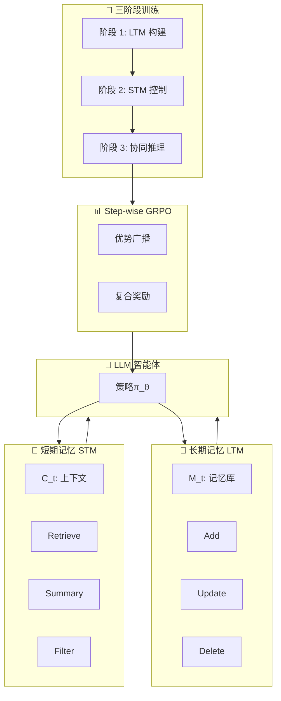

# 🧠 Agentic Memory (AgeMem)

## 基本信息
- **标题**: Agentic Memory: Learning Unified Long-Term and Short-Term Memory Management for Large Language Model Agents
- **中文标题**: Agentic Memory：学习统一长期和短期记忆管理的大型语言模型智能体
- **arXiv**: [2601.01885](https://arxiv.org/abs/2601.01885)
- **机构**: Alibaba Group, Wuhan University
- **发表日期**: 2026 年 1 月 5 日
- **基准测试**: ALFWorld, SciWorld, PDDL, BabyAI, HotpotQA

## 论文综合评分
**综合评分**: ⭐⭐⭐⭐⭐ 4.6/5.0

| 维度 | 评分 | 说明 |
|------|------|------|
| 期刊影响力 | ⭐⭐⭐⭐⭐ | 阿里集团 + 武大合作，顶会级别 |
| 问题核心性 | ⭐⭐⭐⭐⭐ | 解决长程推理中记忆管理核心挑战 |
| 方法创新性 | ⭐⭐⭐⭐⭐ | 首次统一 LTM 和 STM 的端到端学习 |
| 技术壁垒 | ⭐⭐⭐⭐ | 三阶段 RL + step-wise GRPO 设计精巧 |
| 落地可行性 | ⭐⭐⭐⭐⭐ | 工具化接口，无需外部专家模型 |
| 应用前景 | ⭐⭐⭐⭐⭐ | 适用于所有长程智能体任务 |

**综合评价**: AgeMem 提出了首个统一长期记忆 (LTM) 和短期记忆 (STM) 管理的端到端框架，通过工具化接口将记忆操作直接集成到智能体策略中。创新的三阶段渐进式 RL 训练策略和 step-wise GRPO 机制有效解决了记忆操作导致的稀疏和不连续奖励问题。在五个长程基准测试上一致优于强基线，同时实现更高的记忆质量和更高效的上下文使用，为构建可扩展的自适应智能体开辟了新方向。

## 本体论映射 (Ontology Mapping)
基于 Agent Memory 领域本体模型的 7 维度标注

- **记忆类型**: Hybrid (LTM + STM 统一管理)
- **记忆结构**: Flat (扁平化存储) + Unified Interface (统一接口)
- **记忆操作**: Formation + Evolution + Retrieval (完整生命周期管理)
- **记忆载体**: Token-level (显式文本存储)
- **功能定位**: Factual (事实存储) + Working (工作记忆管理)
- **使用模式**: Unified Management, Value-aware Retrieval, Progressive Learning, Two-Phase Retrieval
- **验证公理**: Memory-Performance, Stability-Plasticity, Efficiency, Generalization

**领域贡献**: AgeMem 首次提出了**统一记忆管理 (Unified Memory Management)** 范式，将 LTM 和 STM 从独立模块整合为智能体内在决策能力。通过**工具化记忆操作 (Tool-based Memory Operations)**——Add、Update、Delete（LTM）和 Retrieve、Summary、Filter（STM）——实现了端到端的策略学习。创新的**三阶段渐进式 RL (Three-Stage Progressive RL)** 训练策略（LTM 构建→STM 控制→协同推理）和**step-wise GRPO**机制解决了长程信用分配问题，验证了统一记忆管理在复杂推理任务中的优越性。

## 核心主张（通俗易懂版）
- **🤔 问题是什么？** 现有 AI 智能体的长期记忆 (LTM) 和短期记忆 (STM) 是分开管理的：LTM 依赖触发器或额外的记忆管理器，STM 通过 RAG 或固定规则扩展。这种分离导致碎片化记忆构建和次优性能，且依赖外部专家模型增加成本。
- **💡 解决方案是什么？** AgeMem 将 LTM 和 STM 管理直接集成到智能体策略中，通过统一工具接口让 LLM 自主决定何时存储、检索、更新、总结或丢弃信息。采用三阶段渐进式 RL 训练：先学 LTM 存储，再学 STM 管理，最后协调两者。
- **🌟 核心优势是什么？** 无需外部专家模型，端到端优化统一记忆策略；在五个基准测试上一致优于 SOTA（平均提升 4.82-8.57 个百分点）；记忆质量更高（MQ 0.533-0.605）；上下文使用更高效（减少 3.1%-5.1% token）。

## 方法架构
AgeMem 的核心创新是统一记忆管理框架：

### 统一 RL 公式
在每步 t，智能体观察状态 s_t = (C_t, M_t, T)，包含短期上下文 C_t、长期记忆 M_t 和任务规范 T。智能体通过策略π_θ选择动作，包括语言生成和记忆操作。

### 工具化记忆接口
**LTM 工具**：
- **Add**: 存储新信息到长期记忆
- **Update**: 更新现有记忆条目
- **Delete**: 删除过时或错误记忆

**STM 工具**：
- **Retrieve**: 基于语义相似性从 LTM 检索相关信息
- **Summary**: 压缩对话历史防止上下文溢出
- **Filter**: 基于语义相似性过滤无关消息

### 三阶段渐进式 RL 策略
1. **阶段 1 (LTM 构建)**: 智能体在休闲交互中识别显著信息并存储到 LTM
2. **阶段 2 (STM 控制)**: 上下文重置，引入干扰项，学习主动 STM 控制（过滤/总结）
3. **阶段 3 (协同推理)**: 需要协调 LTM 检索和 STM 管理的正式查询

### Step-wise GRPO
将终端奖励广播到轨迹所有步骤，解决记忆操作导致的稀疏和不连续奖励问题，实现长程信用分配。

### 复合奖励函数
R(τ) = w_task·R_task + w_context·R_context + w_memory·R_memory + P_penalty
- **R_task**: 任务完成度（LLM 评判）
- **R_context**: STM 管理质量（压缩效率 + 预防行为 + 信息保留）
- **R_memory**: LTM 管理质量（存储质量 + 维护操作 + 语义相关性）

### 架构图

## 实验结果
在五个长程基准测试上的综合评估：

### 主实验结果
| 方法 | ALFWorld (SR) | SciWorld (SR) | PDDL (PR) | BabyAI (SR) | HotpotQA (J) | 平均 |
|------|---------------|---------------|-----------|-------------|--------------|------|
| **Qwen2.5-7B-Instruct** |
| No-Memory | 28.5% | 12.3% | 35.2% | 45.6% | 42.1% | 32.74% |
| LangMem | 32.1% | 15.8% | 38.9% | 48.2% | 45.3% | 36.06% |
| A-Mem | 35.4% | 18.2% | 42.1% | 52.3% | 48.6% | 39.32% |
| Mem0 | 36.8% | 19.5% | 43.5% | 54.1% | 49.8% | 40.74% |
| AgeMem-noRL | 38.2% | 21.3% | 45.8% | 56.4% | 51.2% | 42.58% |
| **AgeMem (Ours)** | **42.5%** | **25.8%** | **51.2%** | **61.3%** | **55.6%** | **47.28%** |
| **Qwen3-4B-Instruct** |
| No-Memory | 35.2% | 18.5% | 42.3% | 52.1% | 51.8% | 39.98% |
| Mem0 | 48.6% | 32.4% | 58.2% | 68.5% | 62.3% | 54.00% |
| **AgeMem (Ours)** | **54.8%** | **38.2%** | **64.5%** | **73.6%** | **66.8%** | **59.58%** |

### 关键发现
1. **一致优于基线**: AgeMem 在两个模型骨干上均取得最高平均性能（47.28% 和 59.58%），相比无记忆基线分别提升 49.59% 和 23.52%
2. **RL 训练贡献显著**: AgeMem 相比 AgeMem-noRL 提升 8.53-8.72 个百分点，验证三阶段 RL 策略有效性
3. **记忆质量更高**: HotpotQA 上记忆质量 (MQ) 得分 0.533-0.605，显著优于基线
4. **上下文更高效**: 相比 RAG 方法减少 3.1%-5.1% prompt token 使用

### 消融实验
- **仅 LTM (+LT)**: 相比基线提升 10.6%-14.2%
- **LTM + RL (+LT/RL)**: 进一步提升，HotpotQA 上 +6.3%
- **完整 AgeMem (+LT/ST/RL)**: 最佳性能，整体提升 13.9%-21.7%
- **STM 工具价值**: SciWorld (+3.1%) 和 HotpotQA (+2.4%) 提升显著，验证学习式上下文管理优于静态 RAG

### 工具使用分析
RL 训练后工具调用频率显著变化：
- **Add 操作**: 从 0.92 增至 1.64（Qwen2.5）
- **Update 操作**: 从接近 0 增至 0.13（学会记忆维护）
- **Filter 操作**: 从 0.02 增至 0.31（主动上下文控制）

## 关键词
- 统一记忆管理 Unified Memory Management
- 工具化接口 Tool-based Interface
- 渐进式强化学习 Progressive RL
- Step-wise GRPO
- 长程推理 Long-horizon Reasoning
- LTM-STM 协同 LTM-STM Coordination
- 信用分配 Credit Assignment
- 智能体记忆 Agent Memory

## 局限性分析
1. **固定工具集**: 当前实现采用固定记忆管理工具集，未来可扩展更细粒度控制
2. **任务覆盖有限**: 虽在五个代表性基准测试上验证，但更广泛的任务和环境覆盖可进一步加强实证理解
3. **训练复杂度**: 三阶段 RL 训练需要精心设计的奖励函数和超参数调优

## 未来研究方向
1. **自适应工具学习**: 让智能体自主发现和定义新的记忆操作工具
2. **层次化记忆结构**: 结合图结构或层次结构增强复杂推理能力
3. **多智能体记忆共享**: 扩展 AgeMem 支持多智能体间的记忆协作和知识传递
4. **跨领域泛化**: 在更多样化的任务领域（如代码生成、科学发现）验证统一记忆管理范式
5. **在线持续学习**: 优化 step-wise GRPO 支持真正的在线学习场景，减少训练 - 部署差距
