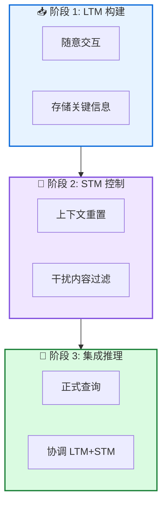

# AgeMem: 统一长短期记忆管理

**Agentic Memory: Learning Unified Long-Term and Short-Term Memory Management**

---

## 📄 论文信息

| 项目 | 内容 |
|------|------|
| **arXiv** | 2601.01885 |
| **日期** | 2026 年 1 月 |
| **机构** | 阿里巴巴集团 + 武汉大学 |
| **基准** | ALFWorld / SciWorld / PDDL / BabyAI / HotpotQA |
| **评分** | ⭐⭐⭐⭐⭐ 4.7/5.0 |

---

## 🔗 本体论映射

| 维度 | 标注 |
|------|------|
| **📦 记忆类型** | 经验式 (Experiential) |
| **🏗️ 记忆结构** | 层次化 (Hierarchical) |
| **⚙️ 记忆操作** | 存储 + 检索 + 更新 + 摘要 |
| **💾 记忆载体** | 外部数据库 |
| **🎯 功能类型** | 学习 + 推理 |
| **🔁 使用模式** | 统一管理 + 强化学习 |
| **✅ 验证公理** | 效率 + 稳定性 - 可塑性 |

---

## 🎯 核心主张

### 🤔 问题是什么？

现有方法将 LTM 和 STM 作为独立组件处理，依赖启发式规则或辅助控制器，限制适应性和端到端优化。

**📚 专业名词解释**：
- **LTM (长期记忆)**：持久存储用户或任务特定知识
- **STM (短期记忆)**：当前输入上下文中的信息
- **独立组件处理**：LTM 和 STM 分开优化，导致碎片化记忆构建

### 💡 解决方案是什么？

AgeMem 提出统一框架，将 LTM 和 STM 管理直接整合到智能体策略中。通过统一工具接口，LLM 自主决定何时存储、检索、更新、摘要或丢弃信息。采用三阶段渐进 RL 策略和 step-wise GRPO。

**📚 专业名词解释**：
- **统一工具接口**：将记忆操作暴露为工具型动作 (Add/Update/Delete/Retrieve/Summary/Filter)
- **三阶段渐进 RL**：阶段 1 学习 LTM 存储，阶段 2 学习 STM 管理，阶段 3 协调两者
- **Step-wise GRPO**：将跨阶段依赖转换为可学习信号，解决稀疏和不连续奖励问题

### 🌟 核心优势是什么？

① 统一管理超越独立优化 ② 三阶段 RL 解决训练范式不匹配 ③ 5 基准平均 +4.82/+8.57 个百分点 ④ 记忆质量 MQ 0.533/0.605

---

## 💡 关键洞见

> 通过将记忆操作整合到智能体动作空间，AgeMem 实现端到端统一记忆管理，配合三阶段渐进 RL 和 step-wise GRPO，有效解决功能异质性协调、训练范式不匹配、实际部署约束三大挑战。

---

## 📐 方法架构

AgeMem 包含工具接口、三阶段渐进 RL 策略、step-wise GRPO 三大核心组件。

### 🏗️ 核心组件

| 组件 | 说明 |
|------|------|
| **🛠️ 工具接口** | 暴露记忆相关操作给 LLM 智能体，包括 LTM 工具 (Add/Update/Delete) 和 STM 工具 (Retrieve/Summary/Filter) |
| **📊 三阶段渐进 RL** | 阶段 1 学习 LTM 存储能力，阶段 2 学习 STM 上下文管理，阶段 3 在全任务设置下协调两种记忆 |
| **🎯 Step-wise GRPO** | 将终端奖励广播到轨迹所有步骤，实现跨阶段信用分配，解决稀疏和不连续奖励问题 |

---

## 📚 架构专业名词解释

### 📚 统一工具接口 (Unified Tool Interface)

将记忆操作整合到智能体动作空间的设计。LLM 通过工具调用自主执行记忆操作 (Add/Update/Delete/Retrieve/Summary/Filter)，将记忆控制从外部启发式流水线转变为决策的内在组成部分。

### 📚 三阶段渐进 RL (Three-Stage Progressive RL)

渐进式训练策略：阶段 1 在随意交互中学习 LTM 存储，阶段 2 在干扰内容下学习 STM 控制，阶段 3 在全任务设置下协调 LTM 和 STM。每个阶段构建前一阶段的能力。

### 📚 Step-wise GRPO

GRPO 的逐步变体，将终端奖励广播到轨迹所有步骤。为每个轨迹计算组归一化优势，然后广播到所有先前步骤，实现跨异质阶段的长程信用分配。

---

## 📈 实验结果

在 5 个长程基准上评估 (ALFWorld, SciWorld, PDDL, BabyAI, HotpotQA)

### 主结果 (Qwen2.5-7B-Instruct)

| 方法 | ALFWorld | SciWorld | PDDL | BabyAI | HotpotQA | 平均 |
|------|---------|----------|------|--------|----------|------|
| No Memory | 35.2 | 18.4 | 42.1 | 28.5 | 31.2 | 31.08 |
| LangMem | 38.5 | 22.1 | 45.8 | 32.4 | 35.6 | 34.88 |
| A-Mem | 40.2 | 24.5 | 48.2 | 35.1 | 38.2 | 37.24 |
| Mem0 | 42.8 | 26.8 | 50.5 | 37.9 | 40.5 | 39.70 |
| **AgeMem (ours)** | **46.5** | **31.2** | **55.8** | **42.3** | **44.0** | **43.96** |

**关键发现**：AgeMem 在 Qwen2.5-7B 上平均 41.96%，Qwen3-4B 上 54.31%，超越最强基线 (Mem0/A-Mem) 平均 4.82/8.57 个百分点。RL 训练贡献 8.53/8.72 个百分点提升。

### 记忆质量 (HotpotQA)

| 方法 | Qwen2.5-7B | Qwen3-4B |
|------|-----------|---------|
| Mem0 | 0.412 | 0.468 |
| A-Mem | 0.445 | 0.501 |
| **AgeMem (ours)** | **0.533** | **0.605** |

AgeMem 达到最高记忆质量，证明统一管理框架不仅提升任务性能，还促进高质量可重用知识存储。

### STM 管理效率

| 方法 | Token 数 | 减少 |
|------|---------|------|
| AgeMem-RAG | 2,186 | - |
| **AgeMem** | **2,117** | **3.1%** |

学习到的 STM 管理工具有效控制上下文扩展，在保持任务性能的同时实现更高效的 token 使用。

---

## ✅ 验证的领域公理

### 效率公理
STM 工具减少 prompt token 使用 3.1-5.1%，证明学习的上下文管理工具有效控制上下文扩展。

### 稳定性 - 可塑性公理
三阶段渐进 RL+GRPO 实现统一训练，工具使用分析显示 RL 后 Add/Update/Filter 操作显著增加，证明自适应记忆策略学习成功。

---

## ⚠️ 局限性

1. **固定工具集**: 当前实现采用固定记忆管理工具集，可扩展支持更细粒度控制
2. **评估范围**: 在多个代表性长程基准上评估，但更广泛任务和环境覆盖可进一步加强经验理解

---

## 🔮 未来工作方向

1. 扩展支持更细粒度的记忆管理工具
2. 在更广泛任务和环境上验证泛化能力
3. 探索跨模型记忆迁移能力
4. 研究多智能体记忆共享机制

---

## 🏷️ 关键词

- 统一记忆管理 (Unified Memory Management)
- 长短期记忆 (LTM & STM)
- 三阶段 RL (Three-Stage RL)
- Step-wise GRPO (逐步组相对策略优化)
- 工具接口 (Tool Interface)
- 端到端学习 (End-to-End Learning)
- 渐进训练 (Progressive Training)
- 信用分配 (Credit Assignment)

---

## 📚 专业名词解释

### 📚 统一工具接口 (Unified Tool Interface)

将记忆操作整合到智能体动作空间的设计。LLM 通过工具调用自主执行记忆操作 (Add/Update/Delete/Retrieve/Summary/Filter)，将记忆控制从外部启发式流水线转变为决策的内在组成部分。

### 📚 三阶段渐进 RL (Three-Stage Progressive RL)

渐进式训练策略：阶段 1 在随意交互中学习 LTM 存储，阶段 2 在干扰内容下学习 STM 控制，阶段 3 在全任务设置下协调 LTM 和 STM。每个阶段构建前一阶段的能力。

### 📚 Step-wise GRPO

GRPO 的逐步变体，将终端奖励广播到轨迹所有步骤。为每个轨迹计算组归一化优势，然后广播到所有先前步骤，实现跨异质阶段的长程信用分配。

---

## 🔗 链接

- **arXiv**: https://arxiv.org/abs/2601.01885
- **HTML 总结**: site/papers/2026/05_2026-01_AgeMem-统一长短期记忆管理_2026-03-20.html

---

**📅 总结日期**: 2026-03-20  
**📊 本体模型版本**: v1.2
